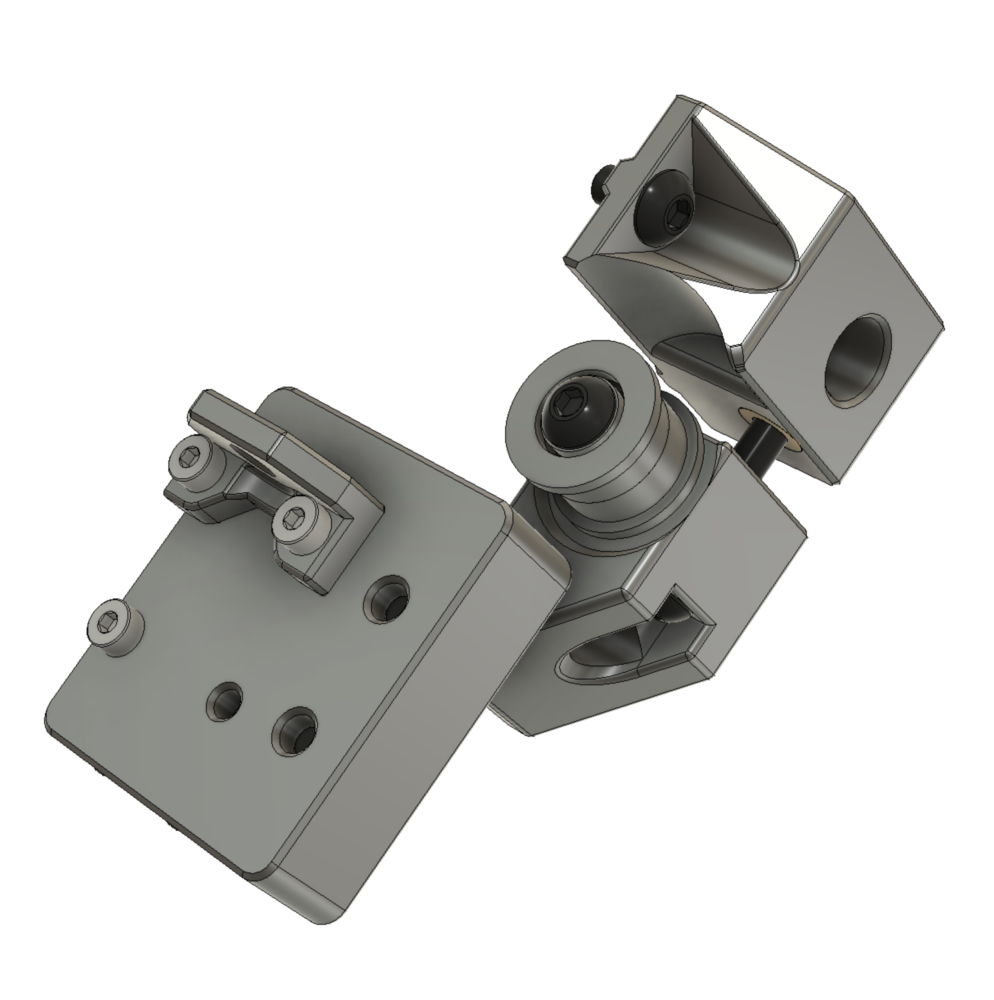
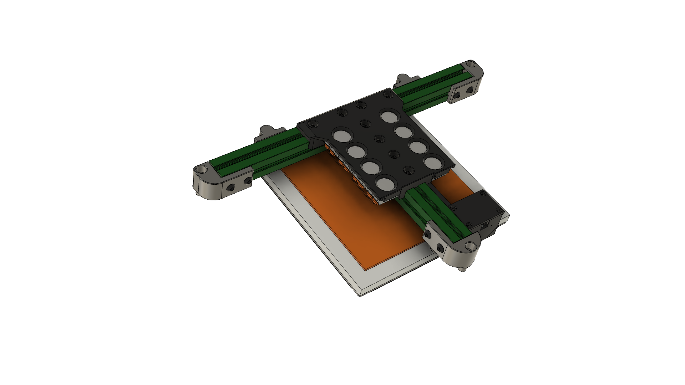
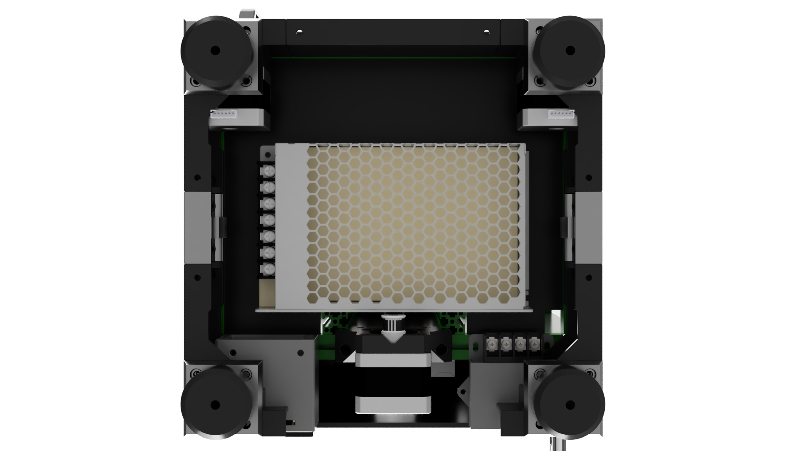

# Instructions

In a nutshell: **it's not that hard**.

Even as a first-time, scratch build, it's reasonable to do the mechanical side in only a few hours.

Even if you're also doing BoxZero at the same time, the gantry can stay in place, as you work around it.

The build order isn't as prescribed as a V0, because the bedframe can be easily added and removed, and because the motors can go in before or after the MotorCorners... this is an under-appreciated benefit of T0.

**You can do it!**  Lots of people have, without even these instructions.

When in doubt, consult the CAD, but realize that not all screws and nuts are present yet.  If there's a hole that looks like it should have a screw, measure the hole depth and assume that all screws into extrusion will need 3-4mm of hidden depth.  There are almost certainly missing steps here, but these instructions are based on building 5 T0s without a manual, from memory.

And yes, the steps are a little bit high level in a few places; we'll improve these over time, with more pictures, especially.

## Prep
* **Skim the [list of PRs](https://github.com/zruncho3d/tri-zero/pulls) on the GitHub** - is there anything new and useful for you?
* Print parts per [parts guide](PARTS.md)
* Print [NDNs](https://github.com/zruncho3d/f-zero/tree/main/STLs/NoDropNuts) matched to your extrusions - more than you think you'll need.

## Pre-build
* Add heatsets where needed
  * Note that the bed attachments (3) require recessed heatsets.
* Add nuts to nutbars (one on, one off) and loosely attach rails to them
* Loosely attach pulleys to motors
* Add 2 screws to each belt-retention part (3 parts total).  They use formed threads.  Push down hard until the screw is started and keep the hexdriver aligned.  
* Build a [ZeroClick](https://github.com/zruncho3d/ZeroClick), per the instructions.

## V0 Disassembly
For conversions, of course!
* Remove the V0 Z assembly
  * .. but leave the rear verticals in place
  * Remove bedframe (possibly by removing the rail M2 screws... that's one way)
  * Take it all off.  You'll need the extrusions.
  * Remove Z railstops
  * Remove rear Z motor/stepper unit
* Remove baseplate
  * Loosen screws on front horizontal extrusion and/or front verticals.
  * Cut 20mm-wide, 15mm-deep notches on each side of the original baseplate, matching the CAD and the DXF.  Use flush cutters with ABS or a dremel or band saw with ACM.
* Remove toolhead for ZeroClick attachment
  * Frees up space to get to work, but optional.

## Build
* Ensure you have all needed screws preloaded, likely with NDNs.
* Slide rails or sliders into place
  * Loosened frame screws, plus twisting the frame, should make this possible in-place.
  * Use V0 frame alignment jig parts for rails.  
* Slide in the modified baseplate, along with the front extrusion.  
  * Corner cutouts to the front!

#### Assemble lower frame & skirt parts

* Attach MotorCorners/screws and rear corners to the frame
* Attach fan skirts to the frame
* Add motors into the MotorCorners and add 4 screws each

#### Assemble front Z parts

* Assemble front idlers (2)
  * Forming threads for idlers will take a little time.  
    * Ideally, add a washer on the outer end of the bearing stack (against the screw head), and tighten all the way.
* Add each Z joint assembly to each front carriage.
  * Only 3 M2 screws are needed; a shorter M2x6 goes on the bottom outer side; longer M2x8 screws are up to with the z joints.   The flat part is on top.
* Align pulleys so that belts have 0.5-1mm of clearance from the frame when tensioned. **Don't fully tighten yet.**
* Add front idler attachments; the previous railstop is removed and its nut goes to this part.  The semicircle points downward.  Another added nut goes here for the attachment, plus one below for the moving part.
* Add front idler units
  * Add a screw for locking in place and ensuring it can slide up and down; you tighten this one (against an extrusion) when the tension is set.
  * Add a screw for adjusting the tension
* Add front belts.  Attach with minimal extra belt on top first.  Then snake the belt around, past the pulley, up and to the attachment.  Leave a bit of extra to grab in the future (say, 15 teeth to start; can always trim later, and only when both sides are tensioned fully.)
* Ensure alignment for the front pulleys and lock them down.
* Tension the tensioner and ensure smooth travel across the full range of motion.
* If using printed sliders, lubricate the bearing and slide it up and down until it coats the full full extrusion travel used.

#### Assemble rear Z

* Build rear Z tensioner unit, with screw and bearing stack
  * Run rear Z belt through it first, then add the bearing stack.
  * No washers needed; they're built into the part
* Add rear motor mount
* Add rear motor to rear motor mount
* Add rear idler top unit, which connects the two rear verticals.  Preload side screws into this one, without NDNs, then slide it down and tighten the 2 top side screws.
  * The covered side faces out and should be visible - so you won't see the tensioner at all in the correct orientation.  *Stealthy!*
* Add rear Z slider unit.  4 to 8 m2 screws are fine, with 6 preferred.  It should move smoothly.
* Add rear Z joint into rear slider.
* Attach tensioner screw and add the tensioner unit (the one with a belt already, right?).  Screw the tensioner in a turn or two - the minimum amount to keep it on.
* Route belt around lower pulley and add the rear belt attachment, with some tension applied; it'll float in place.
  * Make sure the rear belt attachment has all 4 holes aligned with the rear slider.
* Slide the belt block down, into the rear Z slider unit.  It should click satisfyingly and hold in place even without screws!
* Add screws to lock the carriage slider bar against the belt block.
* Ensure alignment for the rear pulley and lock it in place.
* Tension the rear Z belt and ensure that the motion is smooth and low-friction over the full travel.
* If using printed sliders, lubricate the bearing and slide it up and down until it coats the full full extrusion travel used.

Note: after a few times, attaching the rear Z belt becomes a ~2 min procedure.  You can do all this with the rear panel in place, because the rear wide carriage mount and the belt block can be at different heights.

#### Assemble bedframe unit

* Assemble nozzle endstop, if desired
* Add 3x100 extrusions, screws/nuts, and Wagos
* Add nozzle endstop, if present
* Add bedframe end parts (3) with screws; leave ends someone loose, as you'll align the bedframe in place later.
* Add bed spacers, bed, and bed screws.  Add loosely, align, then tighten.
* Attach bed power and thermistor wires to the Wagos.  Put high-power and low-power connections on separate sides.
* Add motor cover bumps + screws (4)
* Then add either the small bumpers or large Guitar Feet.  Guitar feet need long M3 screws into the heatsets, with a fender washer or printed spacer for each.
* Adjust all Z drives to equal, high tension.  The higher the tension, the better the printer will hold in place without power.

#### Last steps

* Add Z chain and connect wire bundle.
  * It should snap into place.  If it doesn't, size variation is the culprint.  There maybe a mod for you... check the PRs and ask on `#tri-zero` if this is the case.
* Add bedframe unit and connect to wire bundle.
* Re-add Power Supply; yes, it's tight in there, but it should just fit, with 0.5mm clearance or so.

## Config/Bringup

* Do all the wiring and config to get the extra 2 ports and connect up a probe.
  * If you need a good starter config for your particular board, all Voron Trident configs are basically the same - triple-Z - so all can serve as a starting point.
* Set bed to the right height
  * You may need to adjust the length of the 3 bed-retention screws, add washers, or change bed spacers. Beds, frames, magnets,  and flexplates vary in length; 1/2" (12.7) is a good starting point, but often a few extra mm are needed.  The nozzle should just touch, with a tiny bit of extra travel available.
* Adjust Klipper config
  * However you did it... add the 2x extra Z drivers
  * Add a `z_tilt_adjust` section and configure it
  * Add a `probe` section and configure it for your probe pin
  * Add a `safe_z_home` section; should match the location of your nozzle endstop, if using one.
  * Add a virtual endstop section for the probe, if desired
  * Set up [Auto-Z](https://github.com/protoloft/klipper_z_calibration) if desired
  * Adjust max configure Z height based on a measurement
  * Add provided probe attach/detach macro or configure Klicky macros if you're using them
  * Adjust max Y if you modified the X bar
* Test probe using `QUERY_ENDSTOPS` or the page in your UI.
* Test Z motor directions using `STEPPER_BUZZ` and adjust if necessary; they should go down (+Z) first, then back up.
* Test probe attach and detach macros
* Configure Z height or tune auto-Z for a reasonable first layer
* Do dry-run print to confirm presence of probe macro
* Enjoy never having to level the bed again!!!
  * You're now able to build pretty much any printer, too, if you were able to build, wire, config, and debug this one.  Congrats!
* Post your baby's first steps to `#tri-zero` on DoomCube.   `#build-showcase` and `r/VoronDesign` are great places too.

Zruncho wants to see your build, as do others!!  They're all unique.  Really!

# Helpful Tips

* **NoDropNuts.**  Use them, especially on the frame!  But not the bedframe, as they don't add much there.  Get them from the F0 repo.  Overextrude them to fit tightly in place but still be moved with force.
* Assemble the bed frame loosely.  Screw the 3 corner-joint screws in.  THEN tighten the bed frame, so it experiences no forces except mild twisting.
* Yes, the heatsets go deep into the bed frame ends.
* Go with a beefy NEMA17 motor if possible.  Improves positioning accuracy due to more torque enabling more usable microstepping, and cheaper too.
* To get the right rear nozzle endstop position quickly, don't attach the screws to the hartk endstop board.  Get the height, THEN attach the screws.  Much easier to adjust the height this way.
* Share your progress on `#tri-zero`.  It's really motivating to see everyone's creations and learn from them.
* **Just do it.**  There is no lower-cost way to get ABL on your V0, especially for fresh builds.  Even if you don't care about ABL, the build is more straightforward.

