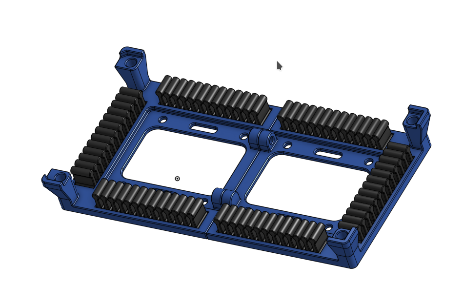
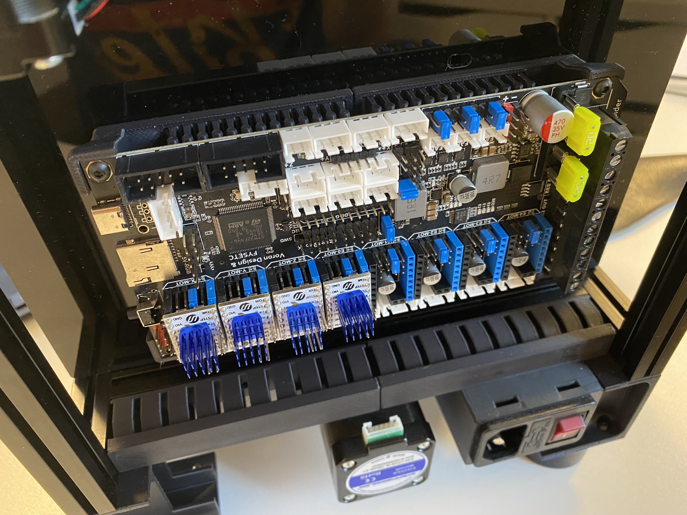

# Overview

Mount for the spider mainboard, supports the [Wire Fingers](https://github.com/zruncho3d/double-dragon/blob/main/STLs/Optional/Wire_Fingers_x6.stl) created by [zruncho3d](https://github.com/zruncho3d).

## BOM
* 4x M3 6mm
* 2x M3 8mm
* 6x M3 Heat inserts (from the V0 BOM)
* 6x [Wire Fingers](https://github.com/zruncho3d/double-dragon/blob/main/STLs/Optional/Wire_Fingers_x6.stl)

Installed it looks like this on my tri-zero.

