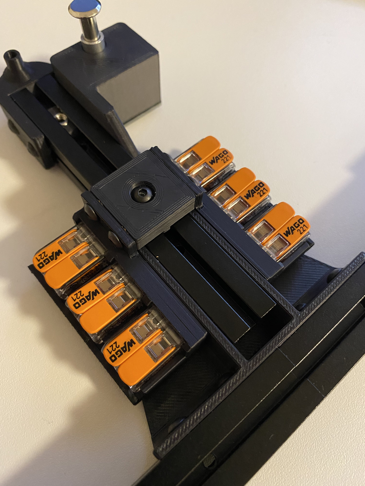
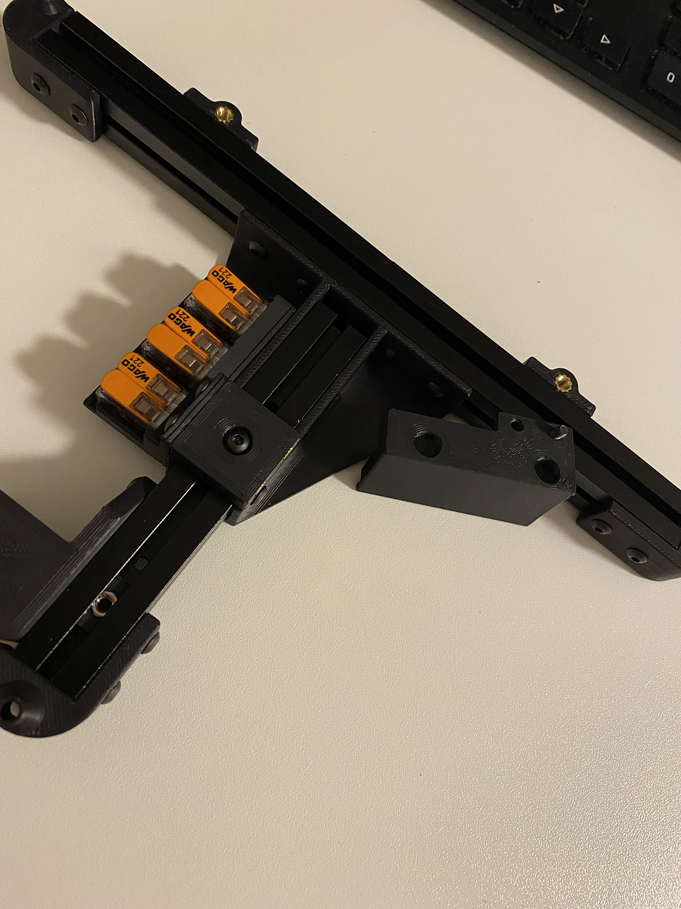
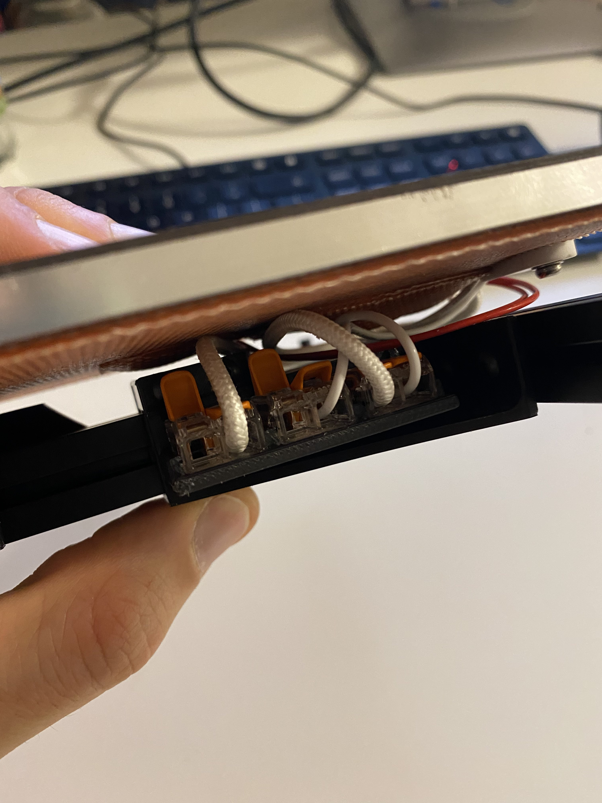

# Overview

Attach Wago 221-412 to your tri-zero bed.

Idea taken from this mod for the v0: https://github.com/VoronDesign/VoronUsers/tree/master/printer_mods/deepfriedheroin/v0_bed_wagos

## BOM
* 1x M3 8mm
* 1x M3 Nut
* 4x M3 6mm
* 4x M3 Heat inserts (from the V0 BOM)
* 6x Wago 221-412

