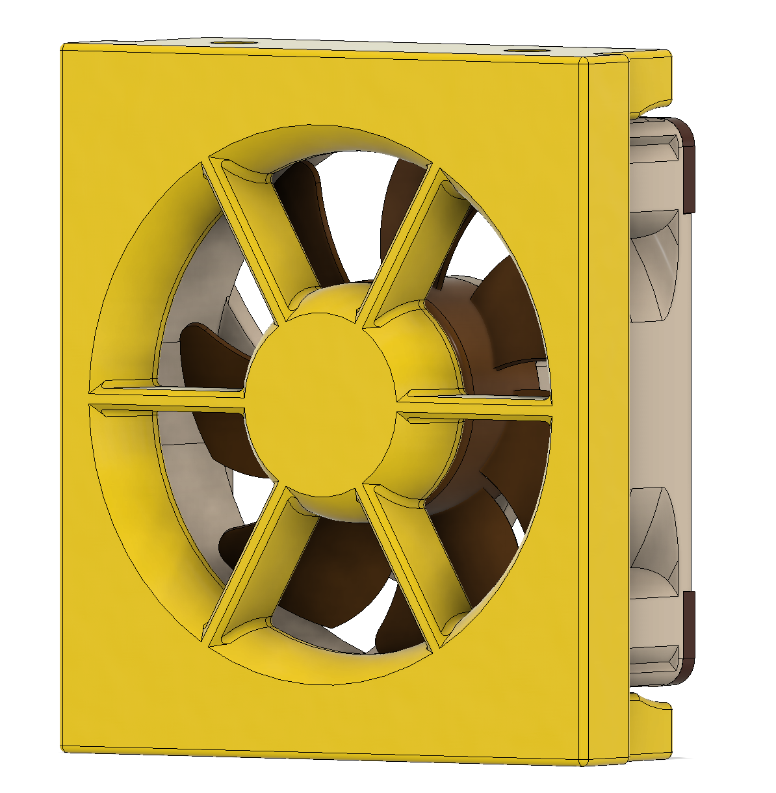
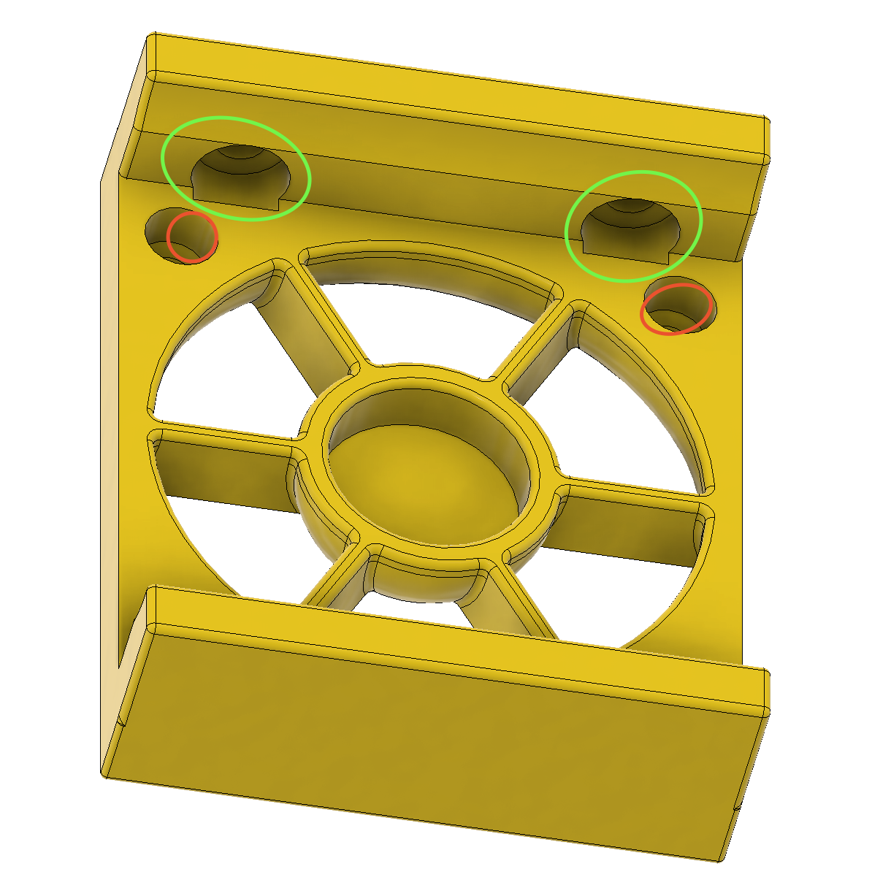

# 40mm Fan Motor Skirt Adapters
## _For Tri-Zero & Plus!_

This is made with Noctua 40mm fans in mind but should work for any. Note that the holes to connect to the frame have a little overlap to the main body--that's fine as you can push the screw past that and then it acts like a captive screw. This way lot easier to instal! It's in the below images in Green. Red is where you will need heat sets (x4) per fan. See here:

