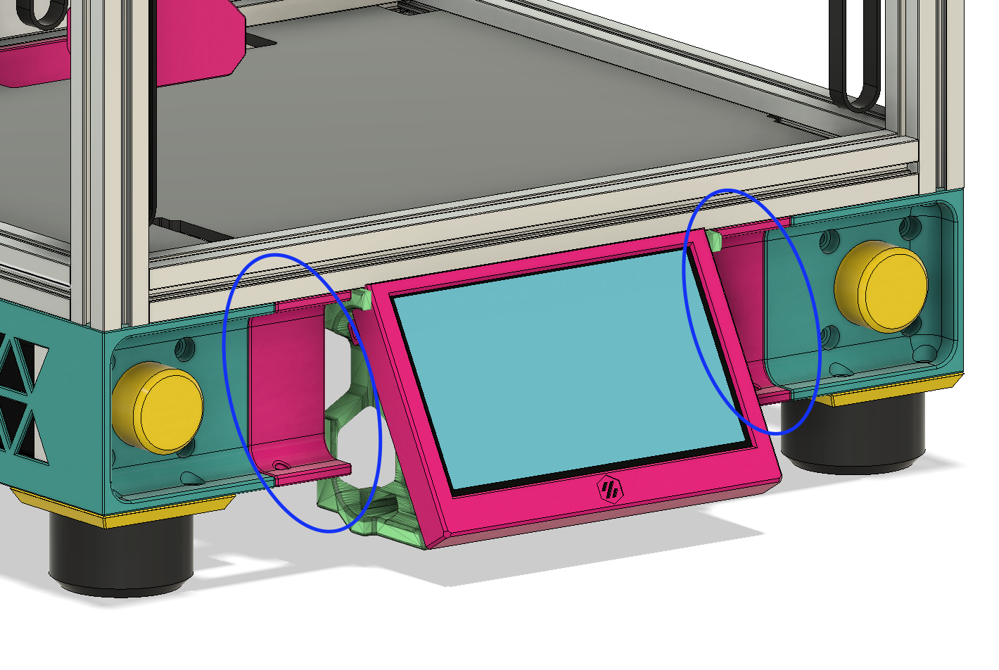

# Tri-Zero Plus: Front Panel Spacers
#### _For Tri-Zero Plus! Not needed for standard/V0 conversions_

This is a simple additional flair piece for the front, that will cover any gaps for whatever front you choose, i.e. waveshare as shown below. Blue highlights the additional pieces.

