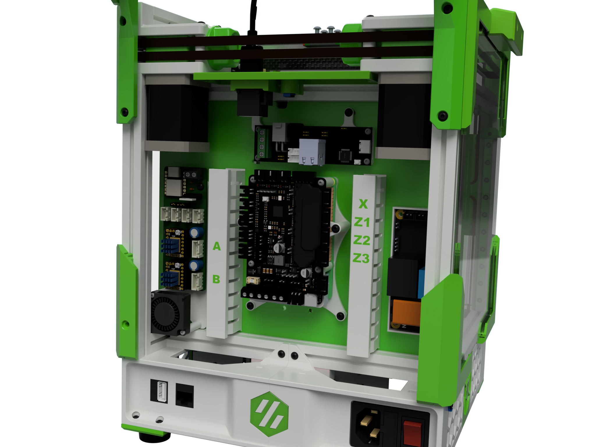
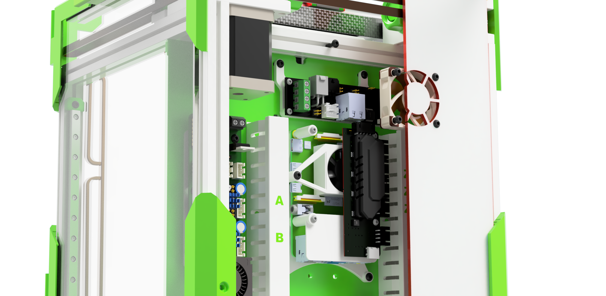

#  Electronic mounts for the T0

This mounts are designed for the TriZero that requires more stepper drivers than a regular V0.
This setup features a RaspberryPI a BTT Pico board and a ECRF Easy Brd as main electronics.

There is also a highly recommended option to go CANBus with the BTT U2C CanBus adapter.
All mounts are designed to use the existing electronic mount points from the V0 design.

As there was still room left a also included a Mount for the BTT PSU relays. I like that board a lot as it shuts down the printer when idling for a longer period of time. Setup is surprisingly easy when the board is directly controlled ny the Raspberry PI. This approach has the additional benefit that the PI is properly shutdown before the power is cut.

## Build Note

A lot of attention went on thermal management as this is usually a critical topic on V0 style printers.
The PI / Pico mount features a 30mm fan that creates airflow over the PU CPU as well as the stepper driver cooling pad an the lower side of the BTT Pico. When combined with a additional 30mm fan in the beck panel a continuous airlow is created from the bottom of the printer to the outside of the printer pannel.

Using this concept I could maintain a MCU temp very close to the chamber temperature (between 55 to 60 degrees) even after hours of printing.

## Printimg

Standard Voron settings

There is an option to print the cable channel covers with multi colors

