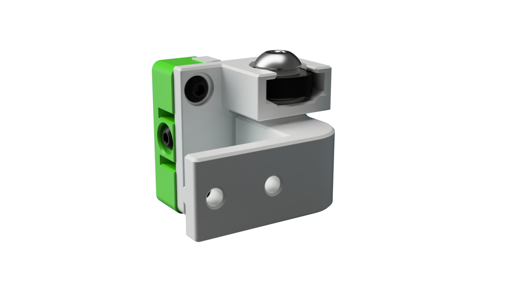
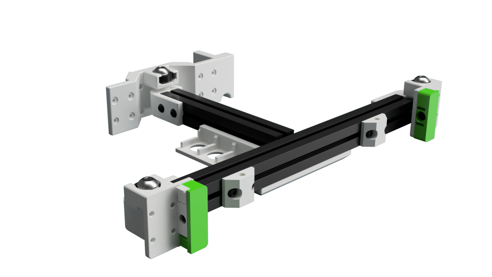
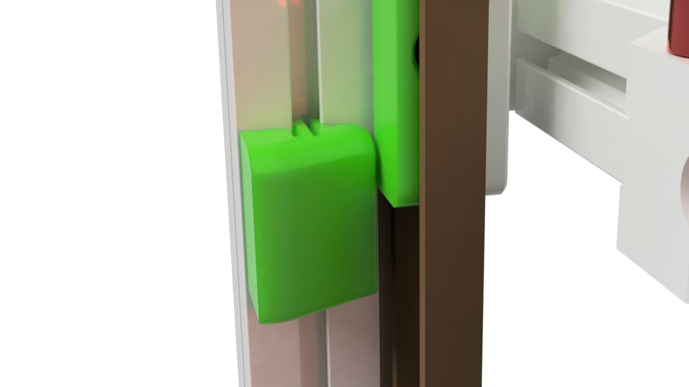

# Tri-Zero - Pivot Bed Mount

Tri-Zero Bed mount replaces the z joints with a metal spherical bearing

Note that the mounts raise the bed by a few mm, therfore you need smaller standofs for the build plate.

## Build Notes

### Replace the stock door latch to create clearence for the front belt clamp !!

This repo only includes the parts that are different fron the standard Tri-Zero

## Printimg

Standard Voron settings

The MGN front mount have some built-in break-away supports