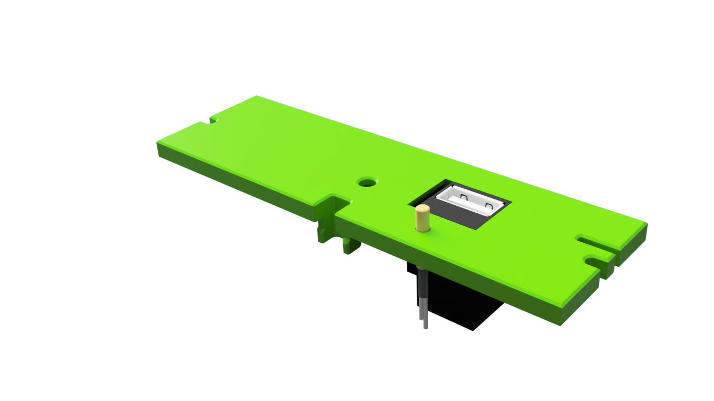

# Hinged USB Camera Tophat

V0.1 style top Hat with V0.2 hinges and front locks. Also features a integrated USB webcam and a motor topdeck with usb keystone and a mounting option for a heat chamber thermal sensor.

Unfortunately all V0.1 part except the panels need to replaced. 
There is also a new topdeck with mounts for a USB keystone and an optional chamber temp sensor.
The top deck is designed for CANBus cables. You need to enlarge the cable opening if you go with with a full cable tree.

| Topdeck |  |
|--- |--- |
|   | 

# OV5640 Camera Module USB Board HD 5 Million

|  |  |  |
|--- |--- |---
| |  https://www.aliexpress.com/item/1005003289816849.html | get the FF 100 or 160 Degree Option |
|  |  https://www.aliexpress.com/item/1005003289816849.html | if you don't like to crimp or solder get a 500mm spare USB cable |

## Build Notes

You need to V0.2 A/B Idler top blocks with the locking mechanism. 
I also use 3mm pin instead of screws for the front door hinge. This way i can simply detach the front door and open the tophat to print PLA and other materials that need a bit more cooling.

## Printimg

Standard Voron settings

I used a Voron V2.4 250mm to print the one part tophat. You need to cut it in pieces if you only have a 120mm build volume.

The MGN front mount have some built-in break-away supports