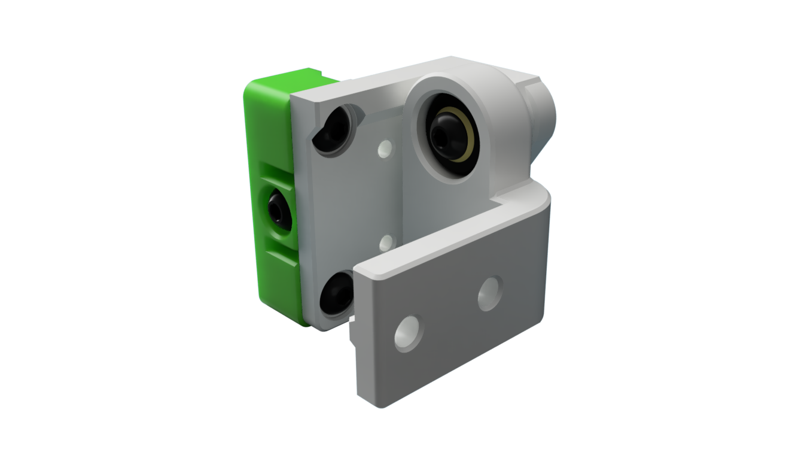
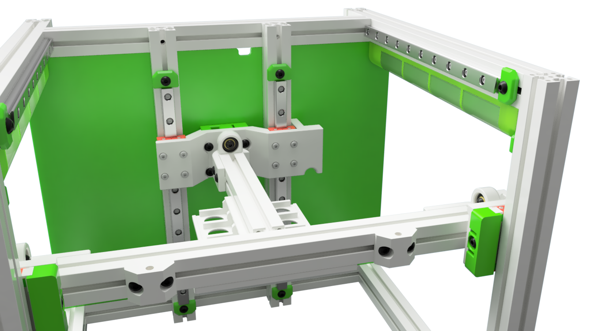
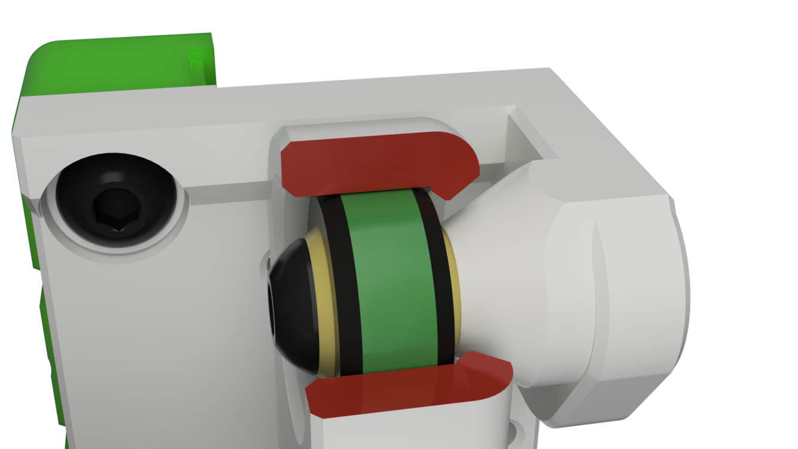
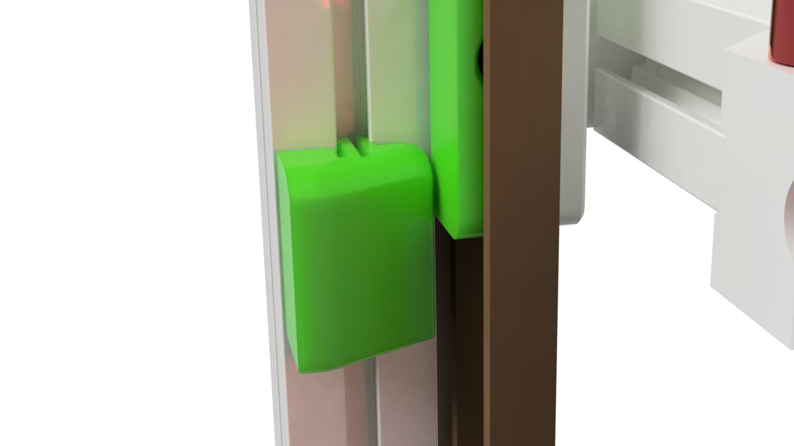

# Tri-Zero - Pivot Bed Mount

Tri-Zero Bed mount using IGUS KGLM 03 bearings as defined pivot point.

Note that the mounts raises the bed by a few mm, therfore you need smaller standofs for the build plate.

This repo only includes the parts that are different fron the standard Tri-Zero

## Build Notes

The bed attachments are designed so that that they allow for +- 1mm axial moovment of the IGUS bearings.
This prevents machnical binding due to thermal expansion or due to longer distances when  the bed is tilted.

### To get this working you need a bit of patiance for fine adjustments when mountig the bed attachments !!

### Replace the stock door latch to create clearence for the front belt clamp !!

## Printing

Standard Voron settings

The MGN front mount have some built-in break-away supports