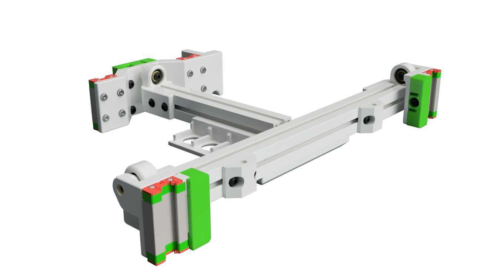

# Tri-Zero - Pivot Bed Mount

Tri-Zero Bed mount using IGUS KGLM 03 bearings as defined pivot point.

Note that the mounts raises the bed by a few mm, therfore you need smaller standofs for the build plate.

This repo only includes the parts that are different fron the standard Tri-Zero

## Printimg

Standard Voron settings

The MGN front mount have some built-in break-away supports