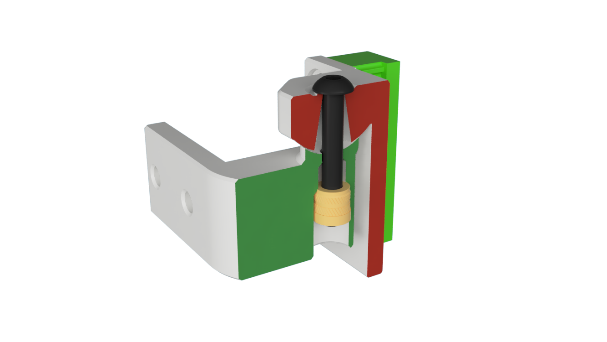
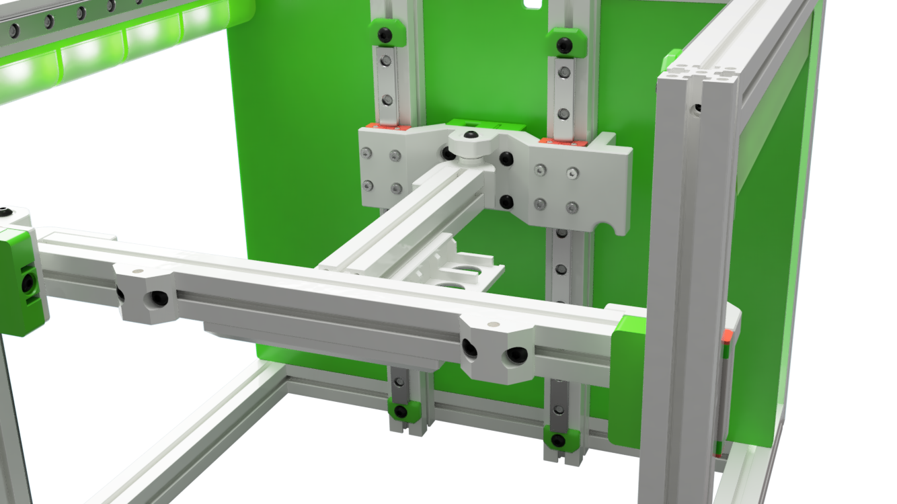

# Tri-Zero - Pivot Bed Mount

A stronger Tri-Zero Bed mount with a defined pivot point

Note that the mounts raise the bed by a few mm, therfore you need smaller standofs for the build plate.

This repo only includes the parts that are different fron the standard Tri-Zero

## Printimg

Standard Voron settings

The MGN front mount have some built-in break-away supports