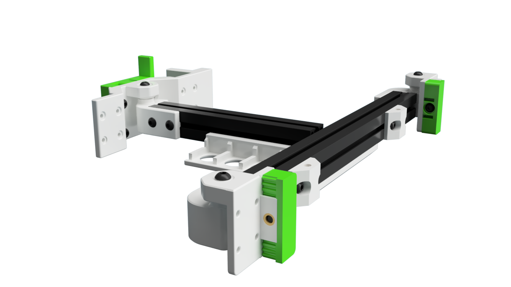
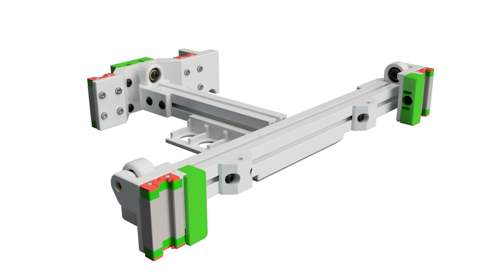
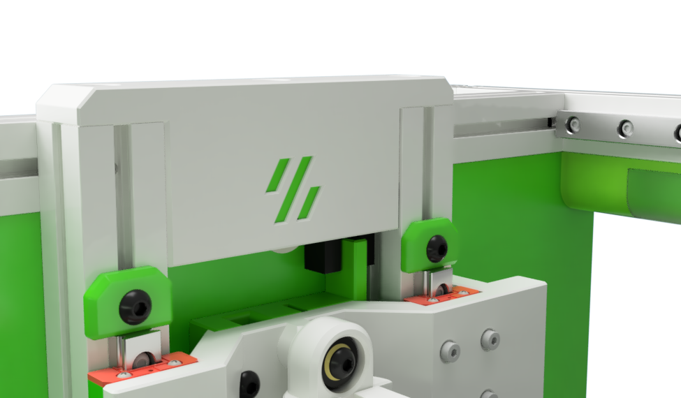
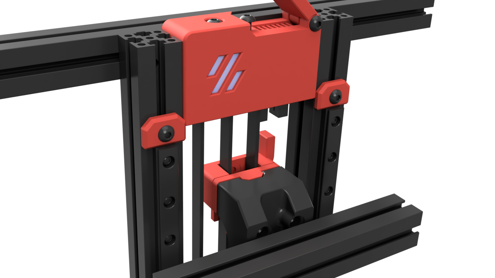

# Tri Zero mods by HBO

Also check out my channel on dicord https://discord.com/channels/825469421346226226/1051614081859207168

| Mod | Image| Notes|
|--- |--- |--- |
| [Skirt Collection](./SkirtsCollection/) |  | Try Zero Skirt collection with multiple Display Variants - Headless - Wavesharte 4.3 Inch Displkay - Waveshare 2.8 Inch Displasy - Voron V0 Oled Display - 12864 Mini Display - |
| [Pivot Bed Mount](./PivotBed_Mount/) |  | A stronger Tri-Zero Bed mount with a defined pivot point |
| [IGUS KGLM 03 Bed Mount](./IGUS_03_Mount/) |  | High-End option using IGUS KGLM 03 bearings as mount points |
| [Opto Z Endstop](./Opto_Z_Endstop/) |  | Optical Z endstop. Verry reliable and more tham 5mm additional Z travel after the stop has triggered. This prevents nozzle crashers into the bed |
| [Z Idler](./Z_Idler/) |  | Alternate Z Idler. Drop In replacement for the V0 AB lower front idlers |
| [Servo Klicky Dock](./ServoKlicky/) |  | Servo driven Dock to hold bed probes. This mode allows to maintain the full build volume by moving the probe away when not in use.  Supports ZeroKlick and Euklid Probes |
| [Nozzle Probe](./Nozzle_Probe/) |  | Modified Nozzel Probe that does not require to resolder the Sex-Bolt PCB - Note: not yet comnpatible with the latest bed mount mods|

# V0 and other Ant Printer Mods

| Mod | Image| Notes|
|--- |--- |--- |
| [YALM ](https://github.com/harry-boe/AntFarm-Projects/tree/main/YALM) |  | YALM - Yet Another LED Mount |
| [Opto Z endstop for Block and Tackle Mod ](https://github.com/harry-boe/AntFarm-Projects/tree/main/Opto_Block_and_Tackle) |  | Optical Z endstop mod for the popular Block and Tackle mod. Verry reliable and more than 5mm additional Z travel after the stop has triggered. This prevents the nozzle from crashing into the bed during leveling |
| [PIP Spool Holder ](https://github.com/harry-boe/AntFarm-Projects/blob/main/PIP_Holder) |  | PIP Holder - Foldable print in place spool holder |

# Related 

| Mod | Image| Notes|
|--- |--- |--- |
| [Ghost LG](https://github.com/harry-boe/Ghost-LG) |  | A V0 Toolhead using LGX Gears |

