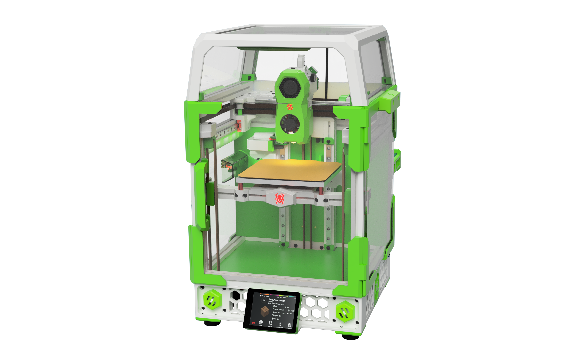
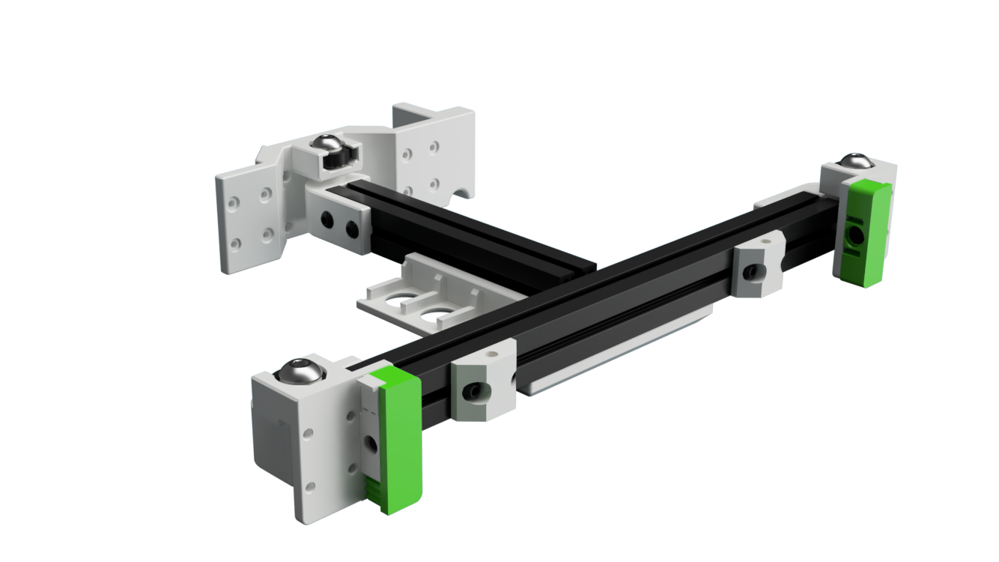
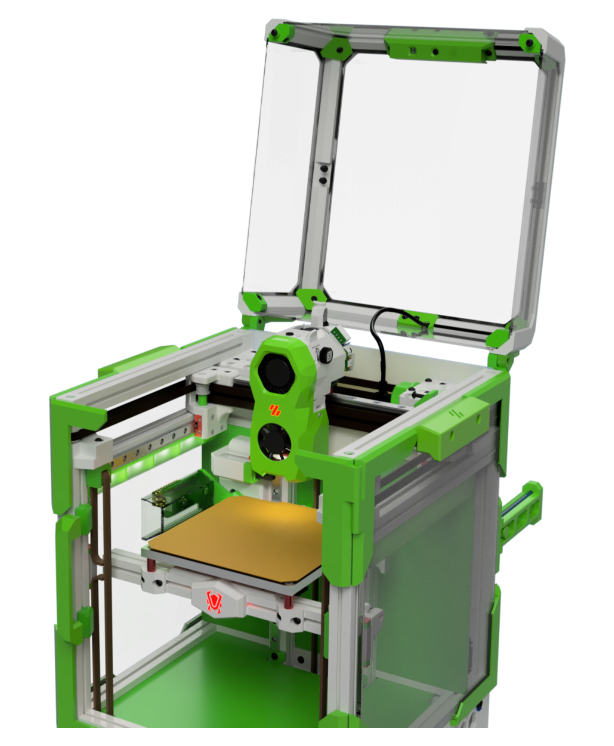
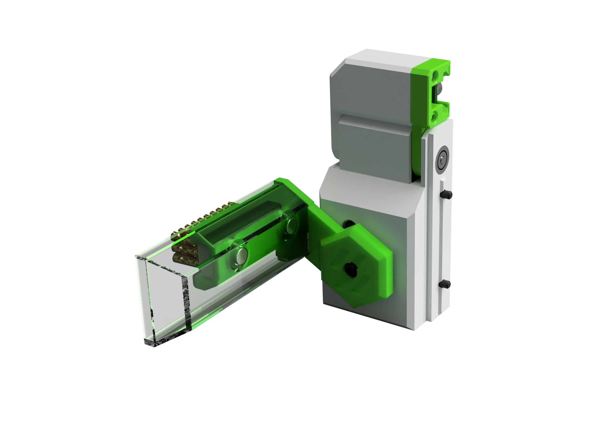
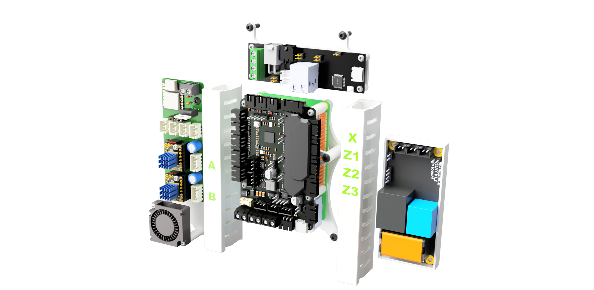

# Tri Zero mods by HBO

This is a collection of all my mods related to the Tri-Zero 3D printer from zruncho.
There are plenty of mods as my version shares only a few part with the original zruncho design.

I try to maintain a "Assembled" CAD to help putting all this mods together
### The assembled CAD might also include mods that are not yet released in any of the repos

Also check out my channel on dicord https://discord.com/channels/825469421346226226/1051614081859207168

| Mod | Image| Notes|
|--- |--- |--- |
| [Skirt Collection](./SkirtsCollection/) |  | Try Zero Skirt collection with multiple Display Variants - Headless - Waveshare 4.3 Inch Display - Waveshare 2.8 Inch Display - Voron V0 Oled Display - 12864 Mini Display - |
| [Pivot Bed Mount](./PivotBed_Mount/) |  | A stronger Tri-Zero Bed mount with a defined pivot point |
| [IGUS KGLM 03 Bed Mount](./IGUS_03_Mount/) |  | High-End option using IGUS KGLM 03 bearings as mount points |
| [GE5C Bed Mount](./GE5C_Bed_Mount/) |  | Option using GE5C bearings as mount points |
| [Bed center brace](./T0_Bed_Center_Brace/) |  | Bed frame assembly with wagos and fans to help with heat distribution in the build chamber |
| [Opto Z Endstop](./Opto_Z_Endstop/) |  | Optical Z endstop. Very reliable and more then 5mm additional Z travel after the stop has triggered. This prevents nozzle crashers into the bed |
| [Z Idler](./Z_Idler/) |  | Alternate Z Idler. Drop In replacement for the V0 AB lower front idlers |
| [Hinged camera Top Hat ](./Hinged_Camera_Tophat/) |  | V0.1 style top Hat with V0.2 hinges and front locks. Also features a integrated USB webcam and a motor topdeck with usb keystone and a mounting option for a heat chamber thermal sensor. |
| [Servo Klicky Dock](./ServoKlicky/) |  | Servo driven Dock to hold bed probes. This mode allows to maintain the full build volume by moving the probe away when not in use.  Supports ZeroKlick and Euklid Probes |
| [Servo click and scrub](./ServoClick_And_Scrub/) |  | Servo driven Dock to hold bed probes and a second servo to position a nozzle brish. |
| [Electronic Mounts](./Electronic_Mounts/) |  | Various electronic mounts for the T0. RaspberryPI, BTT Pico, BTT U2C CANBus and BTT PSU relais |
| [Nozzle Probe](./Nozzle_Probe/) |  | Modified Nozzle Probe that does not require to resolder the Sex-Bolt PCB - Note: not yet compatible with the latest bed mount mods|

# V0 and other Ant Printer Mods

| Mod | Image| Notes|
|--- |--- |--- |
| [YALM ](https://github.com/harry-boe/AntFarm-Projects/tree/main/YALM) |  | YALM - Yet Another LED Mount |
| [Opto Z endstop for Block and Tackle Mod ](https://github.com/harry-boe/AntFarm-Projects/tree/main/Opto_Block_and_Tackle) |  | Optical Z endstop mod for the popular Block and Tackle mod. Very reliable and more than 5mm additional Z travel after the stop has triggered. This prevents the nozzle from crashing into the bed during leveling |
| [PIP Spool Holder ](https://github.com/harry-boe/AntFarm-Projects/blob/main/PIP_Holder) |  | PIP Holder - Foldable print in place spool holder |

# Related 

| Mod | Image| Notes|
|--- |--- |--- |
| [Ghost LG](https://github.com/harry-boe/Ghost-LG) |  | A V0 Toolhead using LGX Gears |

