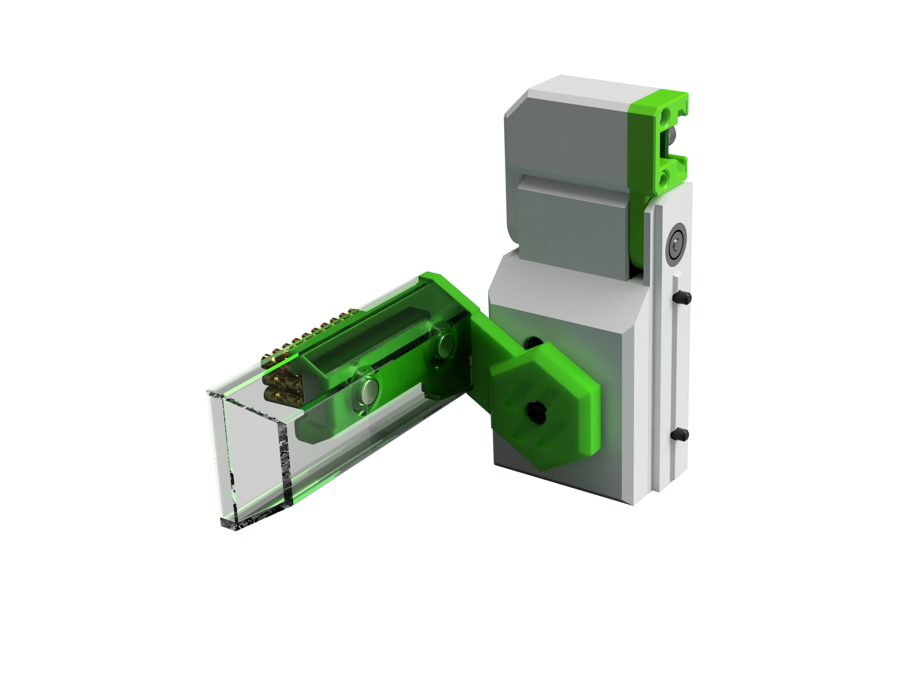

# Servo Powered Docks for the V0 and Variants 

This as a mount for the z-probe that move’s the probe and dock out of the way while printing.
Therefore there is no loss on print volume !
The second feature is a servo drivennozzle brush holder. Again no loss on print volume.

## Renders

TODO

# Printing

All parts print with standard Voron print setting without any supports.
Optimized dock mounts and servo spur gear. There are 3 versions included for each part to deal with tolerances of the servo output shaft.
Note the little dot's near the servo shaft mount for identifing the diferent sizes.

# BOM Notes

TODO

# Firmware

TODO

