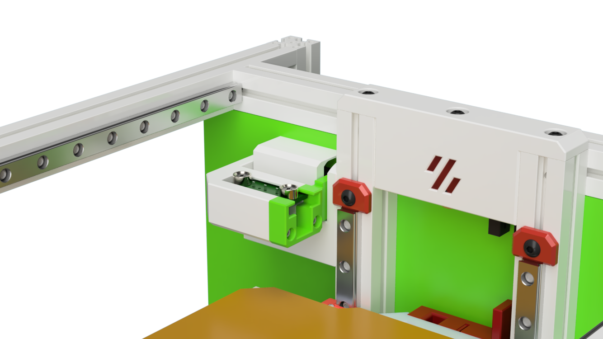
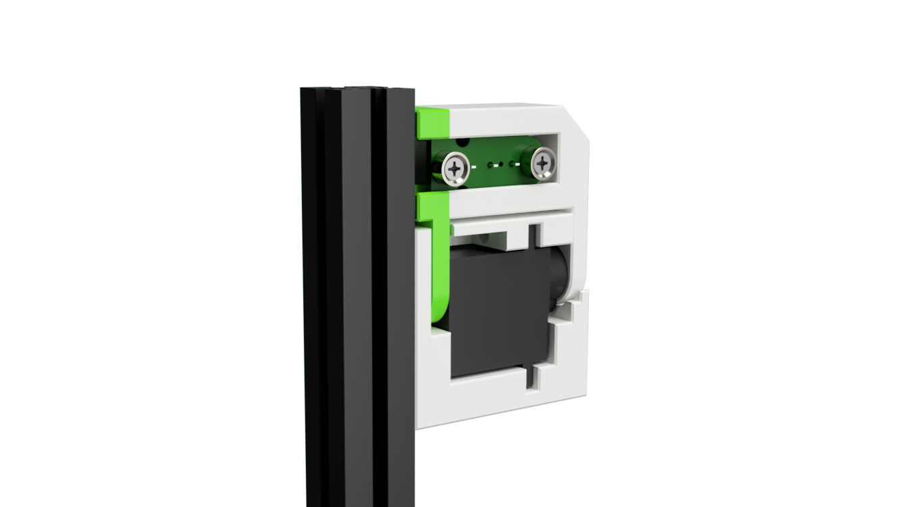
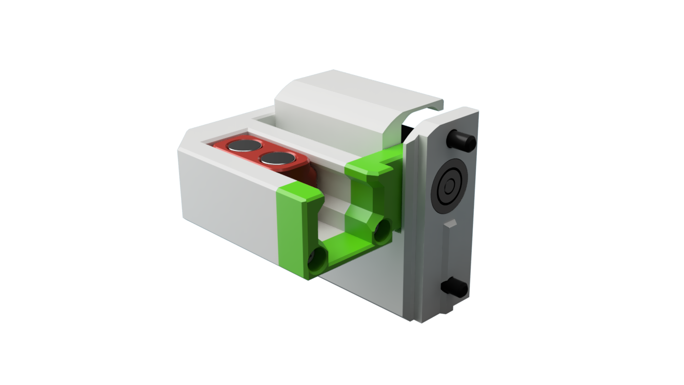

# Servo Powered Docks for the V0 and Variants 

This as a mount for the z-probe that move’s the probe and dock out of the way while printing.
Therefore there is no loss on print volume !

https://user-images.githubusercontent.com/1899323/218826318-dd8349b1-3cd3-4b2f-90a4-cacaf3864f00.mp4

## Renders

| Dock closed | Dock open|
|--- |--- |
| |  |

# Version 2

This is a all new Design. The Updates include:

- Ball bearing supported dock 
- Optimized dock mounts. There are now 3 versions for each mount to deal with tolerances of the servo output shaft.
The mount mounts are maked with dots near the servo shaft hole. The indicate the undercut (amount of press fit) from 90%/95%/100% 

| Front view| Rear view |
|--- |--- |
|| |

| Zero Klick Dock | Euklid Dock|
|--- |--- |
|  | |

# Printing

All parts print with standard Voron print setting without any supports.

# BOM Notes

| Part | Qty | Notes |
| - | - | - |
| Probe | Zero-Click or euklid | Tested on my Ghost LG toolhead |
| - | - | - |
| Servo | 1 | MG90S - Same as for the ECRF |
| - | - | - |
| F623 Ball Bearing| 1 | Same as for the V0 belt idlers |
| M3 x 8 Countersung | 1 | Pivot point for the main dock|
| M3 x 6 | 1 | To mount the servo base to the z-extrusion (top)|
| M3 x 35| 1 | To mount the servo base to the z-extrusion (bottom) |
| | | note that the mounting hole of the servo needs to enlarged to 3mm |
| M2 x 10 self-tapping | 2 | for the dock assembly |

# Firmware

There are some configuration files and snippets in the firmware folder.
They are based on a Euklid probe mounted to a Ghost LG Toolhead. So physical dimensions need to be adjusted to your setup.

WARNING: while configuring your printer make sure that you don't run any z-homing routines with the probe or dock deployed.
It will likely kill your probe mount and maybe the servo gears (if you don't use a servo with metal gears)
(Don't ask me how i know)

# CAD  Notes

The CAD includes all variants in one file.
You need to show/hide the version you like to work with

Also note the Joints (Rotation and sliders) to animate and test the movements

# Changelog

## 24.078.23
- all new version 2
- CAD and all STL's updated

## 29.03.23
- Anti short cover for euklid probe added

## 14.02.23

- multiple minor updates to get the servo movfe more freely 
- CAD und STL's updated
- Firware folder and sample configs added

