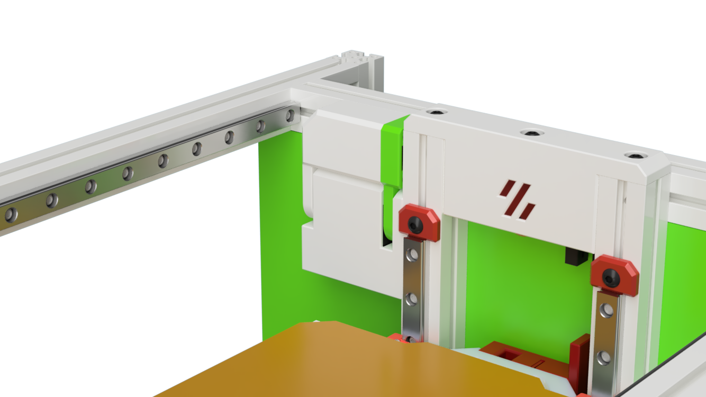

# Servo Powered Docks for the V0 and Variants 

Curently in alpha stage

Parts have been printed but not yet tested on a printer (im still in the prozess of bulding a V0 to test this)

# Printing

All parts print with standard Voron print setting without any supports.

# BOM Notes

| Part | Qty | Notes |
| - | - | - |
| Probe | Zero-Click or euklid | As of yet there is no mount for the euklid on the toolhead (upcomming) |
| - | - | - |
| Servo | 1 | MG90S - Same as for the ECRF |
| - | - | - |
| M3 x 6 | 1 | Pivot point for the main dock|
| M3 x 6 | 1 | To mount the servo base to the z-extrusion (top)|
| M3 x 35| 1 | To mount the servo base to the z-extrusion (bottom) |
| | | note that the mounting hole of the servo needs to enlarged to 3mm |
| M2 x 10 self tapping | 2 | for the dock assembly |
| M3 Insert | 1 | Pivot point mount - use some locktite here |

# CAD  Notes

The CAD includes all variants in one file.
You need to show/hide the version you like to work with

Also note the Joints (Rotation and sliders) to animate and test the movements

