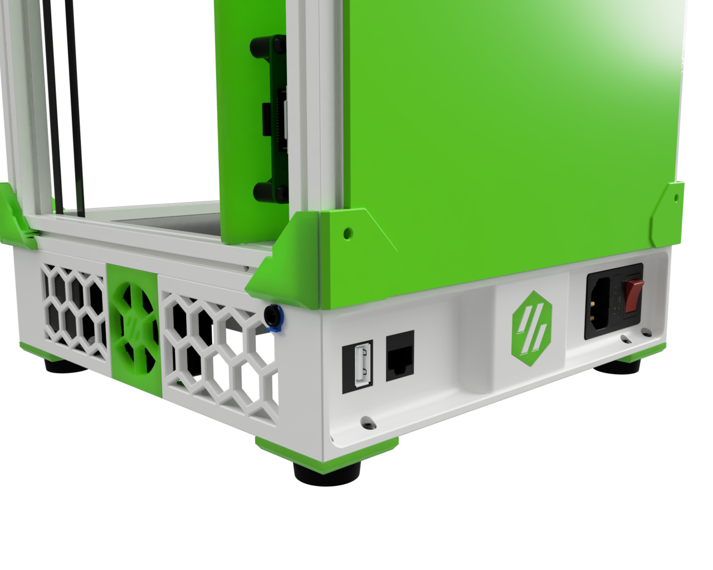
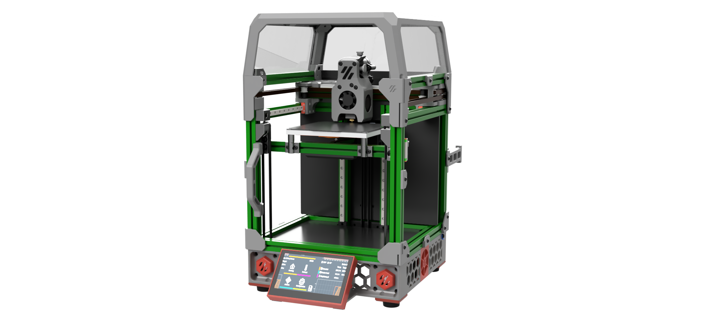
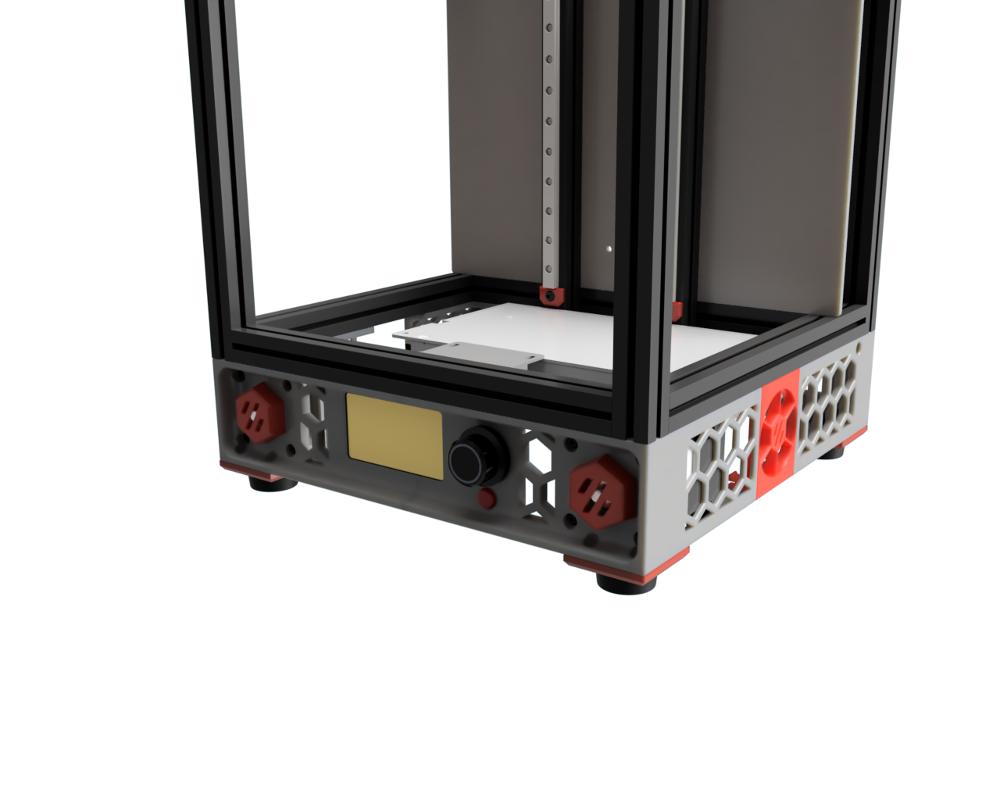
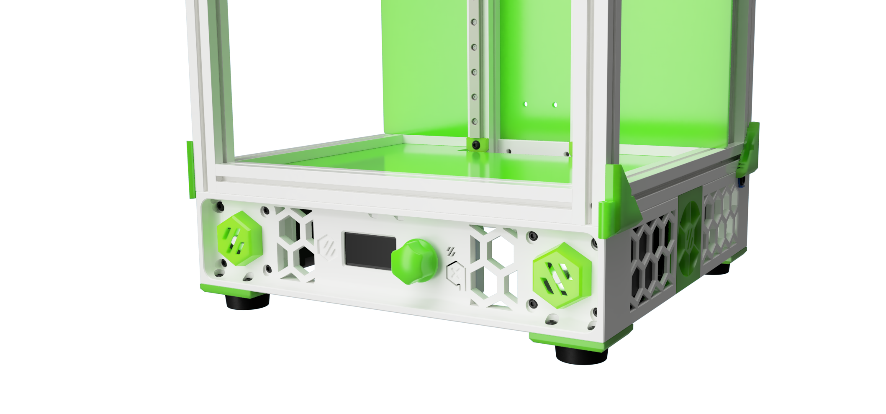

# Collection of Tri-Zero Skirts

This is a Collection of skirts for the try-zero with some additional features.

Right now, there are 5 variations for the skirts and one common rear and common fan mounts.
To start with the rear ..

## Rear Skirts

The rear skirts match all the different front skirts and have the following features

- integrated power inlet mount. To be used with the "standard" v0 power inlet
- 2 keystone mount points to get access to the raspberry pi ports
- Bowden clip mount point. Designed for the E3D style bowden clips. This allows to push the filament and not the tube from the outside. Ready for the ERCF :)

## Fan Mounts

Option: The fan mounts have clips to hold 40x10mm or 40x20mm fans.
If you go with a 20mm fan make sure to order one with a central rib, like the fans from creality.

# Skirt Options

The front skirts are designed for NEMA 17 motors up to a max size of 39 mm in length.

Note that there are two front covers for the GT2 pulleys. One for NEMA's with a shaft of 20mm and one for NEMA's with a 24 mm shaft.

## 1. Headless

This version is intended for users that like to run the tri-zero in headless mode i.e. without display

## 2. Waveshare 2.8" Display

This version is designed for the Waveshare 2.8inch Capacitive Touch Display for Raspberry Pi, DSI Interface
The mounts are designed to bolt on the frame and display with original screws from the back.

## 3. Waveshare 4.3" Display

This version is designed for the Waveshare 4.3inch Capacitive Touch Display for Raspberry Pi, DSI Interface
The mounts are designed to bolt on the frame and display with original screws from the back.
Therefore similar 4.3 inch display might not work without modifications
I'm using a 60cm DSI cable to connect the display with a Raspberry PI back on the back of the V0 
(a Raspberry Pico mount mod is in preparation)

### Reset / Emergency switch
The front display mount also provide a mounting option for a reset or emergency switch.
I'm using this switch to reset a BTT PSU relays. 

The switch in the cad is a standard 7mm momentary switch that is easy to source even from local providers.
Make sure to get a Normally OPEN (NO) switch if you plan to use it with the BTT PSU Relays.
(A Relays mount and firmware configs are in preparation)

## 4. 12864 Mini Display 

This version is designed for the popular 12864 Displays.

Note:
- This displays wont work with the SKR Pico.
- Not all 12864 Displays are the same (the Mellows Fly Mini Screen has slightly differen dimensions)

## 5. V0.1 OLED Display

Many kits come with this tiny littel display.
And the real part turned out nicer than I have expected

# Printing

This mod is based on my design for the V0 and Double Dragon / Wasp printer.
The core design went to many iterations (and spools of filament) to optimize printability and tolerances for keystones, power inlets etc.

I printed the motor corners to check the design but I have not yet built a printer with them. So please provide feedback if you run into issues or confirm the design.

All parts print with standard Voron print setting without any supports.
All parts fit on a V0. However, the max out the build volume on the z axis.
If you need to print on a V0 make sure that your bed springs are really stiff by adding more tension with washers etc.
I had some problems getting nice parts out of the V0 due to the nozzle moving the part due to flex on the bed springs.

# BOM Notes

Recommended Nema 17 Motor: https://www.omc-stepperonline.com/de/nema-17-bipolar-1-8deg-26ncm-0-4a-0-4a-12v-42x42x34mm-4-draehte-17hs13-0404s1

Waveshare Display 2.8inch:  https://www.waveshare.com/2.8inch-dsi-lcd.htm

Waveshare Display 4.3inch:  https://www.waveshare.com/4.3inch-dsi-lcd.htm

Rubber Feet: There are many options. The one in the CAD are these ones here https://de.aliexpress.com/item/1005004478863418.html

7mm Momentary switch:  https://de.aliexpress.com/i/32711341102.html

40x20mm fan:    https://de.aliexpress.com/item/1005002920453385.html

# CAD  Notes

The CAD includes all variants in one file.
You need to show/hide the version you like to work with

# Credits

Thanks to zruncho for all his efforts he puts into the printers for Ants.
It's inspiring for a lot of us!

# Changelog

## 25.11.2022

- Printability enhancements Waveshare 2.8inch display added
    - Prints now well without "fill gap between walls" enabled
    - Optimazation for overhangs
- Mount for 15mm fans added (STL's only) 

## 24.11.2022

- New skirt for the Waveshare 2.8inch display added

## 17.11.2022

- Small changes on Mini Display skirt after real world tests

## 11.11.2022

- Added skirt for V0.1 OLED Display
- Added assembly instructions
- Refactoring of CAD file

## 08.11.2022

- Honeycomb pattern dimensions changed so that there are no thin lines anymore with 0.4mm extrusion with
- fixed a cosmetic error on the honeycomb pattern of the front corners at the side
- more clearance for M4 nuts on bottom side of the skirts
- some minor fixes here and there - like forgotten facets etc.

