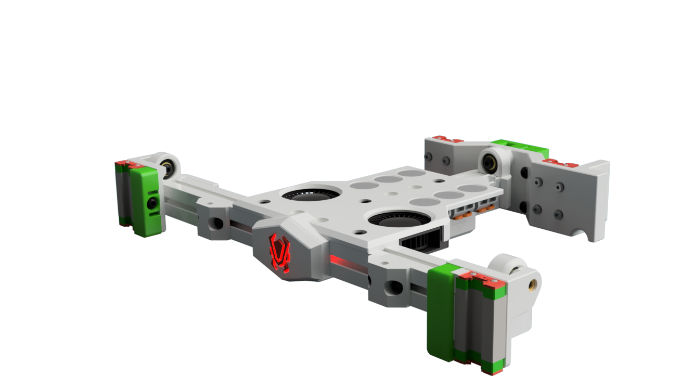
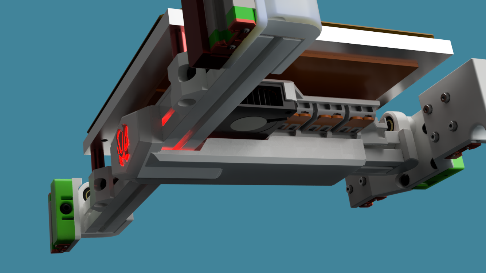

# Tri-Zero - Bed Center Brace with Wagos and fans

Alternate bed cener brace. Flipped to the top to improove accesabilty of the Wagos when the buiold plate is mounted.
Also adds to fans to help with heat distribution in the build chamber. Works best with the lowered bed mounts

Ther is also a optional cable cover that goeas on the underside of the bad frame. That cover includes a iluminated Ant Printers logo. The logo is designed to work with the rainbow barf.

More on the Rainbow Barf here: https://mods.vorondesign.com/detail/3J9JXZNpmvj20VCBslMoag

## Printing

Standard Voron settings

