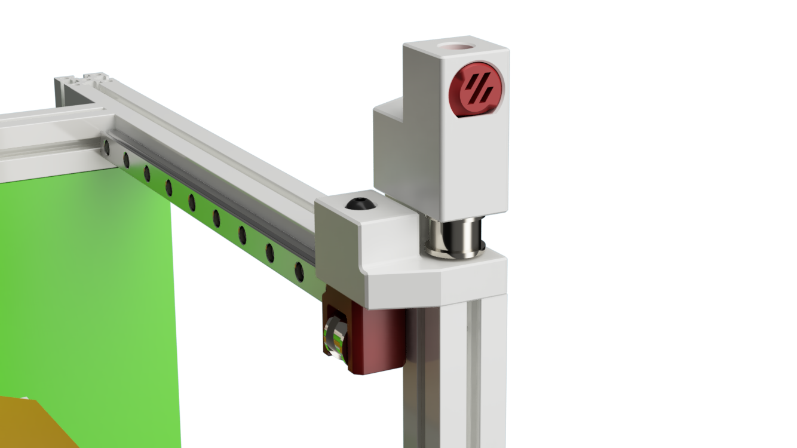
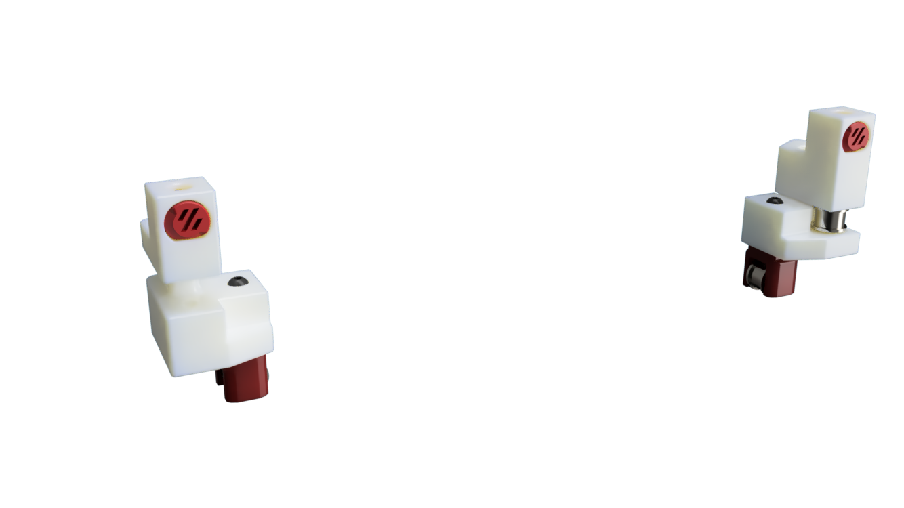

# Z Idler MOD

This MOD replaces the original V0 A and B idler and adds an idler for the Z axis

| Left Idler | Right Idler|
|--- |--- |
| |  |

# Printing

All parts print with standard Voron print setting without any supports.

# BOM Notes

Use some 3 x 14 mm pins or m3x14 screws to attach the bearing stack

# Changelog

## 23.7.23
- Asymetric tensioners to align belt with bed mounts
- All CAD and STL's new

## 2.1.23
- new Version to add clearence for Toolhead
- new CAD and STL's 

## 13.11.2022

- first alpha version

