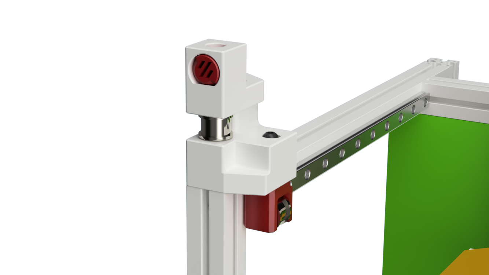

# Z Idler MOD

This MOD replaces the original V0 A and B idler and adds an idler for the Z axis

# Printing

All parts print with standard Voron print setting without any supports.

# BOM Notes

Use some 3 x 12 mm pins to attach the bearing stack

# Changelog

## 13.11.2022

- first alpha version

