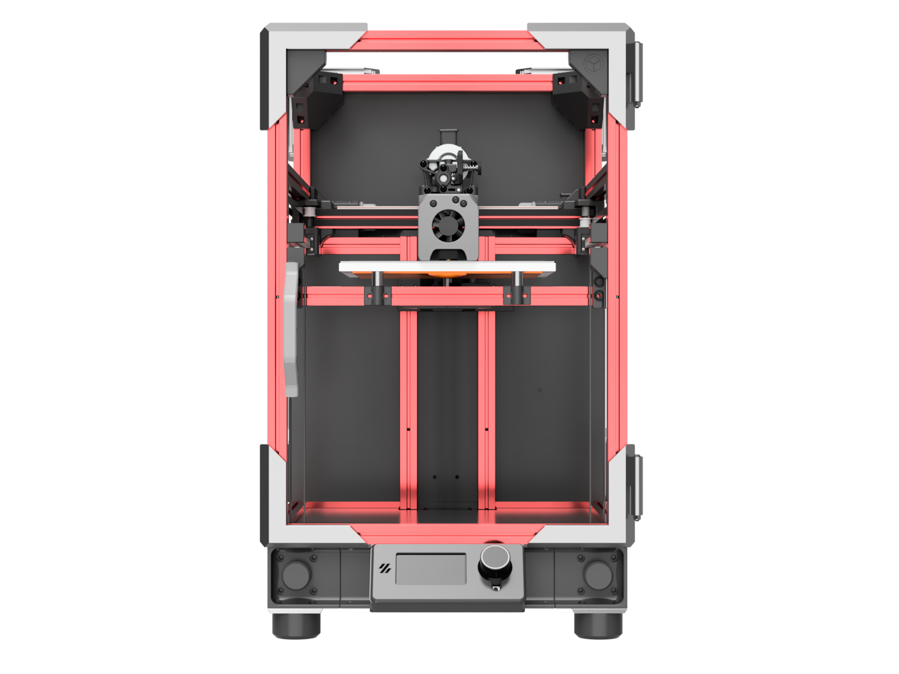
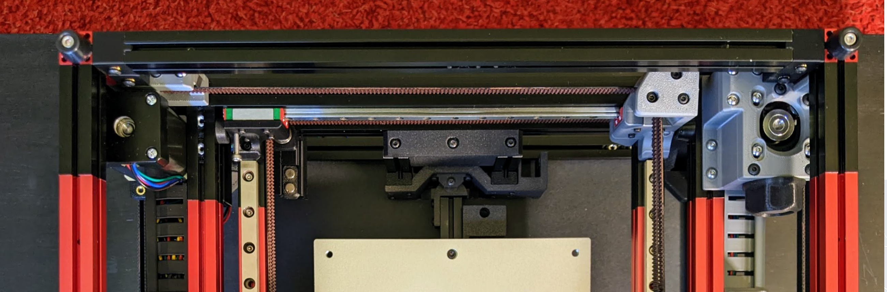

# Plus50

|  |   |
| - | - |
| Front | Iso |

Plus50 adds 50mm of X and Y travel.  

At a high level, that parts are mostly the same, including V0 and the T0 gantry and toolhead.  A few extra parts in the [Plus50](STLs/Plus50) directory are needed to widen the rear umbilical, place the bed optimally, and span the wider skirts.

The Plus50 size just feels right for [BoxZero](https://github.com/zruncho3d/BoxZero).  While you *could* use existing, available Double Dragon parts to extend a tophat, it's not worth it.  Too many parts to print, too many fasteners, and too many areas to seal.

We'll assume that you go [BoxZero](https://github.com/zruncho3d/BoxZero) if you go Plus50, even if that's not strictly necessary.  The BoxZero corners add rigidity, easier sealing, and easier mounting.  You won't regret them at either size.  If doing 400mm verticals, use `Top_Corner_Mini_x4.stl`, unless you really want extra space for Z.

For Z, you have two choices:
- **(1)** Keep Z travel the same, at 120mm.  Go with a 50mm taller frame, mostly retaining V0 frame parts and reusing XY rails for Z axes.  This setup gives needed space for umbilical clearance.
- **(2)** Add 50mm Z travel with 200mm MGN7H rails to match the XY increase and also add umbilical clearance.

In both cases, printed sliders are an option.

## Parts Needed

### Frame: New-build-specific
You'll need the following extrusions:
* 13x 250mm (horizontals, including bedframe)
* 4x 400mm (for verticals)
* 1x 100mm (for rear of bedframe)

### Frame: V0-conversion-specific
For reference, a stock V0 frame has:
* 16x 200mm
* 3x 100mm

To convert, you'll need added extrusion content.  We'll assume you want to put the colors in the front, and can use m3 set screws to connect extrusions with stock 50mm chunks, per the [method noted in BoxZero](https://github.com/zruncho3d/BoxZero#frame-and-corners), using the extrusion wrench available there to avoid marring the extrusions.  

Here's what they look like on Dueling Zero, in the back:

In practice, this method looks great, even if the rear is black or silver; Technologic-style ZeroPanels will cover up the extensions in the front anyway, so you'll never see them.

A suggestion:
* Front Verticals: 2x, 200+200, joined (color)
* Side Horizontals: 6x, 50+200 joined (color)
* Front Horizontals: 2x, 50+200 joined (color)
* Bedframe Front: 1x, 100+50+100 joined (color)
* Bedframe Rear: 1x, 50+100 joined (color or no color)
* Rear Horizontals, 3x 50+100 joined (no color)
* Rear Verticals: 2x 200+200 joined (no color)

This has black for everything in the back, with 50mm chunks on the black part, and color in the front; yes, you will have some colored extrusions left over.  IF you have the dark bits forward, it will save the need for drilling 4 of the holes that connect to X crossbars, but that's about it.  And if you make the rear verticals colored, you'll have 50mm of floating black bits, for better or worse.

So, you need:
* 10-ish 50mm chunks: [MBXL Amazon link for 8x50 + 4x100](https://www.amazon.com/gp/product/B06XJ4T6TW)
* 7-ish 200mm chunks: [MBXL Amazon link for 4-pk](https://www.amazon.com/MakerBeam-XL-Anodized-200x15x15mm-Pieces/dp/B06XHQH9WH)

None of this is set in stone.  You should choose extrusions to match your color desires and ability to chop existing extrusions.  You should place the specific extrusions as much as possible in places where you won't need to drill too many holes.  But good news!  Your original V0 drilling guide will work just fine here.

No frame pic yet showing 50mm chunks, but hopefully these words make it clear.

### Common: New or Conversion

**Z Motors**:

Go for large NEMA17 motors, 40mm body length or larger.  You want the strongest motor possible to resist motion when unpowered, given that the bedframe is much heavier with a larger bed and longer extrusions.

**Larger Bed**

Travel motion goes up to 170x170 in size, with 5mm reserved for a nozzle endstop if present, so something near this range is best.   Something smaller (like 160x160)  leaves space for an endstop Z switch, purge bucket, and/or even a nozzle wiper.  Something larger (like 180x180) leaves clearance at the ends for a more consistent bed temp, as well as heats up the chamber faster if a larger bed fits.

Three main choices here:
* Voron-style MIC6 1/4" Al bed with magnetic tape, in Annex-K3-size, with AC or DC heater
  * [Funssor](https://www.aliexpress.com/item/3256803530287164.html)
* Prusa Mini 190x190-ish thick circuit-board with embedded magnets, DC typically
  * [Fysetc](https://www.aliexpress.us/item/2255800748491824.html)
* Mandala Rose Works-style bed with embedded magnets, with AC or DC heater
  * [MRW Micron 185 magbed](https://mandalaroseworks.com/collections/micron-185)
  * [MRW Micron 160 magbed](https://mandalaroseworks.com/collections/micron-160mm)

**Panels**

Assuming 400mm blind corners:

| Category | Part | Qty | Notes | Link |
| - | - | - | - | - |
| Panels | 262x382x3mm panel | 3 | Side and front panels, clear acrylic
| Panels | 262x262x3mm panel | 1 | Top panel, clear acrylic
| Panels | 262x382x3mm panel | 3 | Rear panel, ACM or ABS
| Panels | Plus50 DXF  | 1 | Baseplate, ACM or ABS

**Longer XY rails**
* +50 --> 1x 200mm MGN9C (for x, TODO link)
* +50 --> 2x 200mm MGN7H (for y, TODO link)
