# Tri-Zero - a triple-belted-Z V0 mod

a Voron Zero mod to add Automatic Bed Leveling - under $100, in only a few hours.

**Make every first layer perfect** and never adjust a bed screw again!  :tada:   

Upgrade your V0, or build a T0 from scratch with an augmented V0 kit.  

#### **Now with a Plus50 size, which adds 50mm X and Y travel, to 170mmx170mm:**

| 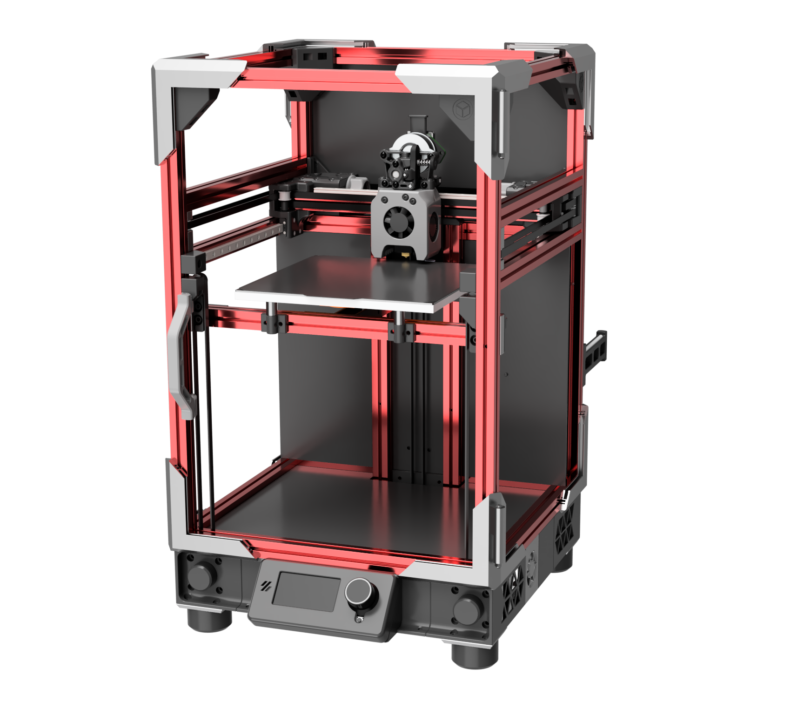 |
| - |
| T0 Plus50 with optional [BoxZero](https://github.com/zruncho3d/BoxZero) mod, Tecnologic-style [ZeroPanels](https://github.com/zruncho3d/BoxZero), and Mini 12864 display. |

|  | 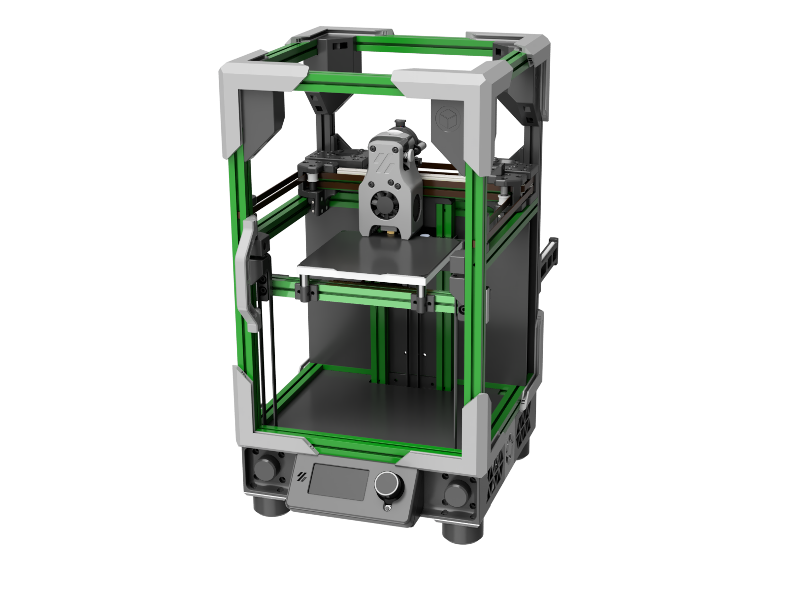
| - | - |
| T0 applied to V0 | T0 + [BoxZero](https://github.com/zruncho3d/BoxZero), [ZeroPanels](https://github.com/zruncho3d/BoxZero), & display.

### Why T0, vs other [Printers for Ants](https://3dprintersforants.com)?
* Less $, fewer failure points, and less potential for ringing than flying-gantry printers
* Faster Z motion compared to lead-screw printers, with no possibility of Z-banding
* Retains full space for electronics on the back
* Uses spare steppers you probably already have

*You don't even need to take the frame apart to do a V0 conversion.*

T0 is actively developed and community-supported, with over 20 builds completed, or in progress, as of October 2022.  Here are a few sample builds:

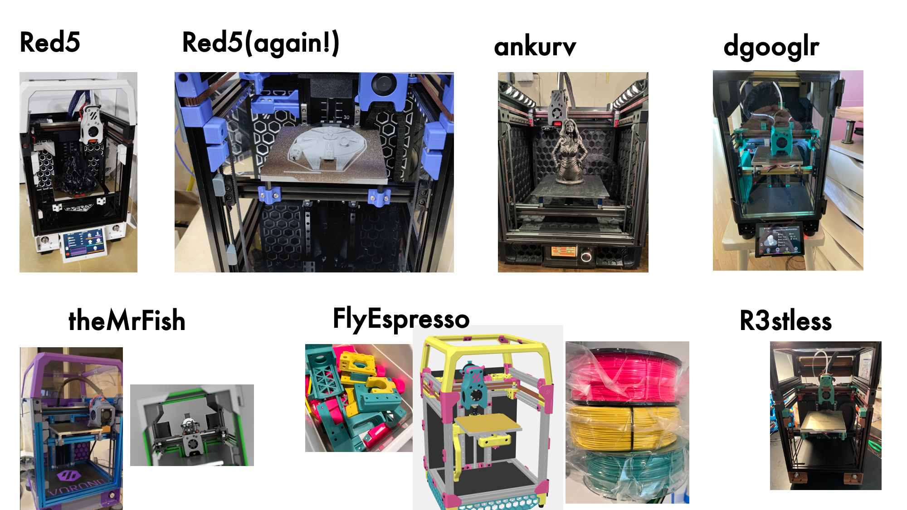

**Compatibility with the V0 ecosystem of kits, parts, and mods is a huge benefit**.

Plus, this mod pairs beautifully with the full family of Tri-Zero spinoffs:
* [BoxZero](https://github.com/zruncho3d/BoxZero) adds stability, easier sealing, and scalability for Plus50
* [ZeroPanels](https://github.com/zruncho3d/ZeroPanels) enables side panels to snap in/out in seconds, with an easy hinged top option
* [Dueling Zero](https://github.com/zruncho3d/DuelingZero) is a fully-boxed Tri-Zero with dual  gantries (!?!)

.. as well as [Double Dragon](https://github.com/zruncho3d/double-dragon), the IDEX V0 mod.

Join us on the [DoomCube Discord](https://discord.gg/doomcube) for any questions, comments, or just to see the latest dev activity.
*  Use `#tri-zero-forum` for support questions and build updates
*  Use `#tri-zero` for general chat and dev activity

Or, just straight to detailed docs:
- #### [Parts](PARTS.md): sourcing details
- #### [Instructions](INSTRUCTIONS.md): build steps, prep, and more
- #### [Plus50 size](PLUS50.md): sourcing and build notes for Plus50
- #### [FAQ](FAQ.md): Common questions, answered
- #### [Change](FAQ.md): Visual summary of past changes

## Overview and features

|  |  |   |
| - | - | - |

|  |  |  |
| - | - | - |

* Perfect Z layers, quiet motion, and great bed stability from 3 belted Z axes; no floppy cantilever here
* Reliable, stable Klicky-style bed probing with the [ZeroClick](https://github.com/zruncho3d/ZeroClick) detachable probe
* Optional rear endstop enables [automatic Z calibration](https://github.com/protoloft/klipper_z_calibration) and even auto-Z-offset for [IDEX](https://github.com/zruncho3d/double-dragon)
* Easy bed attachment and removal with built-in Wago mounts: 3 screws each
* Easy belt attachment and removal: fully tool-less
* Easy single-screw tensioning on all Z axes
* Easy to assemble: no hard-to-access screws or assembly-order nuances
* Your choice of display: 4.3" Touchscreen, Mini 12864, V0 Mini Display, or blank panel
* Supports large NEMA14 and mid-to-large NEMA17 Z motors
* Clean, minimal aesthetics with no-bridge, no-extreme-overhang parts

*This repo includes everything you need to build your own T0, including CAD and STLs for printed parts, as well as a list of parts:*

## Latest Release: Alpha-6

**There's never been a better time to deploy this mod.**

The community is growing.  20+ builds completed.  

With alpha-6, the docs are vastly expanded and improved, and you expect more good stuff to come, to make it easier and faster to build.

**New in this release:**

| 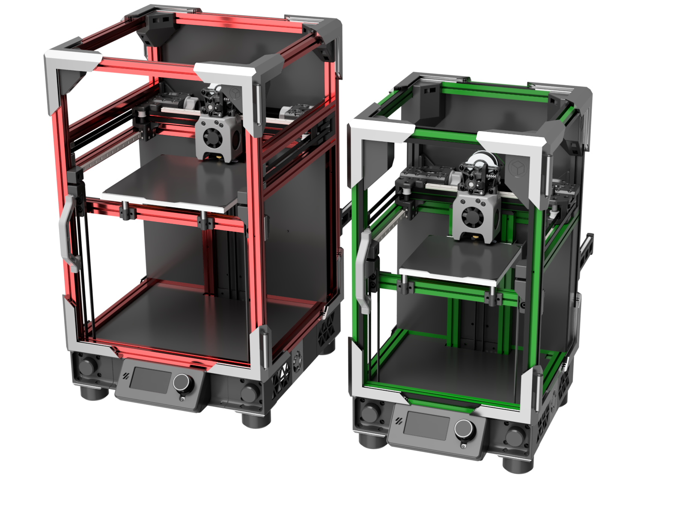 | 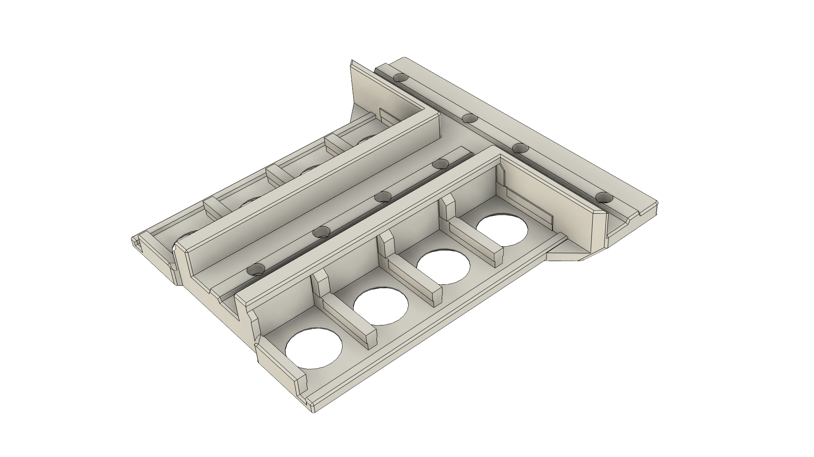 | 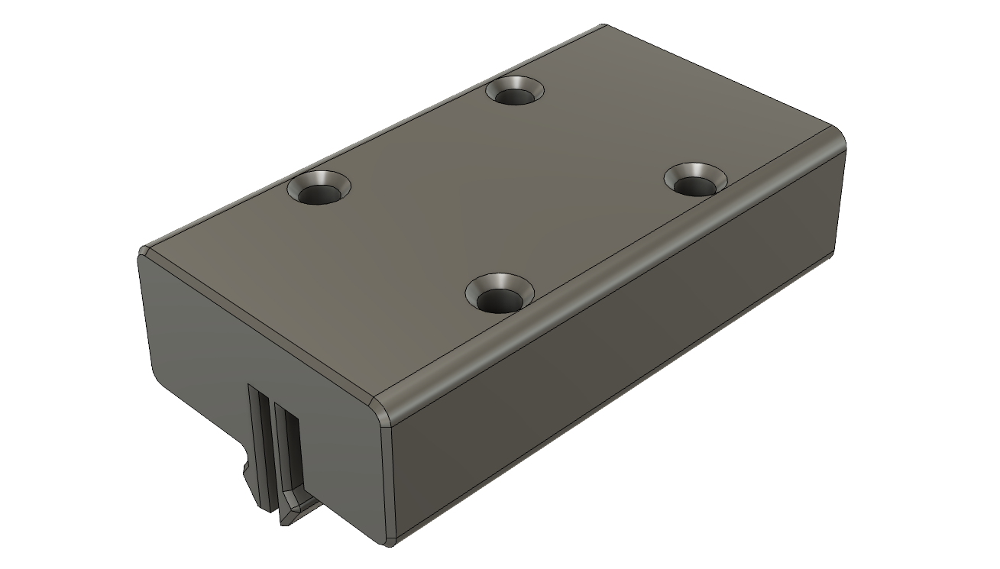 | 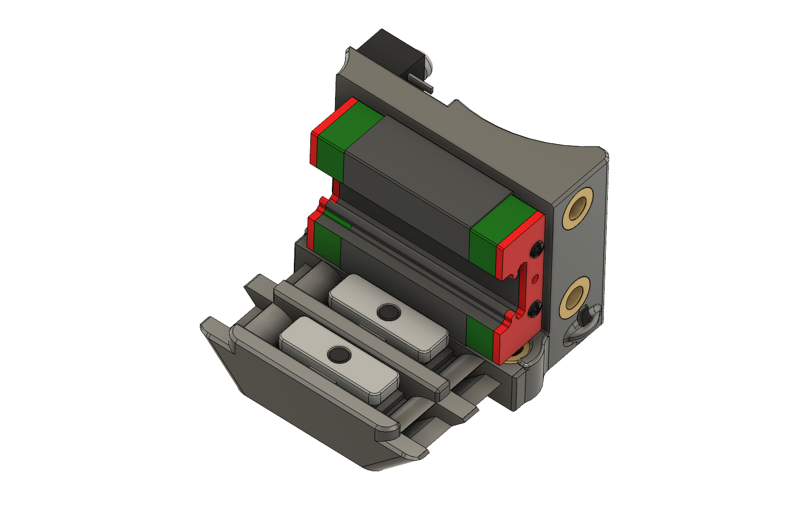 | 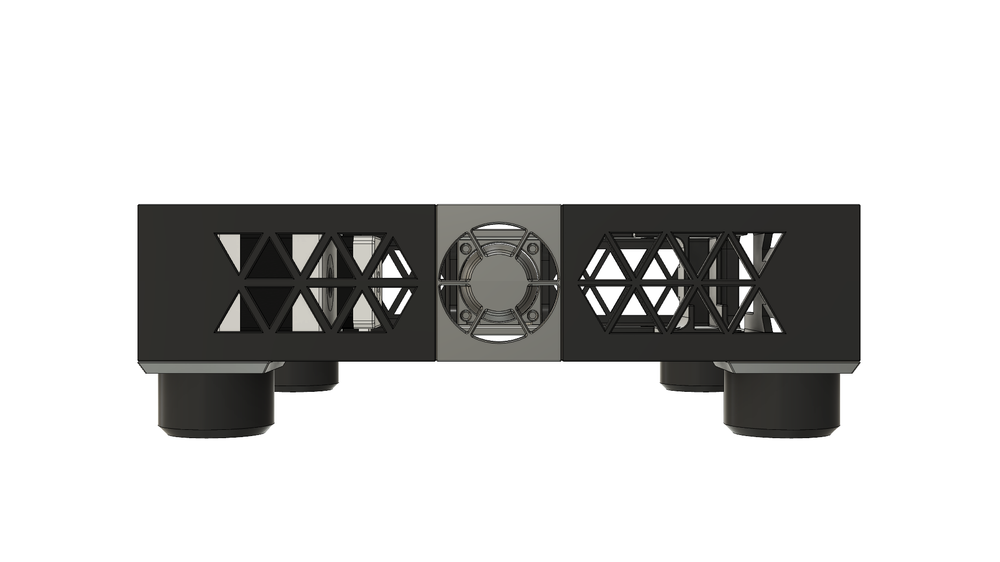  |
| - | - | - | - | - |
| Plus50 Size | Rail-less Z Option | Integrated-Wago Bedframe | No-flush-cut carriages | 40mm Side Fans |

* **Plus50**, or **T0+** for short, is a new, larger, supported build size.  120x120 is good, but 170x170 is more usable, for little extra money.  T0+ can even be a cost-effective conversion for a V0, using 50mm extrusion chunks.  Shop the new [Plus Size](PLUS50.md) section for this year's newest model.

* **Bedframe with integrated Wago mounts**: Oh yes. The new "Connect 4" bedframe center makes bedframe attach/detach even easier, with up to 8 Wago connectors to support a bed heater, thermal fuse, optional AC ground, endstop, and thermistor wires.  Pop the Wagos in and out, toollessly.

* **Rail-Less Z Carriages**: Printed replacements for MGN7H rails that slide in an extrusion channel! Faster to install and saves money, too.  Used successfully on at least 4 builds at this point, including [Dueling Zero](https://github.com/zruncho3d/DuelingZero), so it's time to be more public about them.  *Currently considered experimental*, as the design is likely to change, and there is no long-term wear data on them.

* **No-flush-cut MGN9C carriage** Inspired by the [Double Dragon](https://github.com/zruncho3d/double-dragon) MGN9C mount; another T0 spinoff, first seen on [Dueling Zero](https://github.com/zruncho3d/DuelingZero).  No more one-time-use belts!

* **40mm fan skirt**: A potentially quieter option.

**Improved in this release:**

| 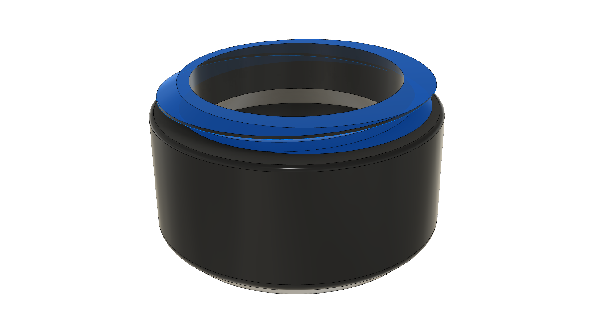 | 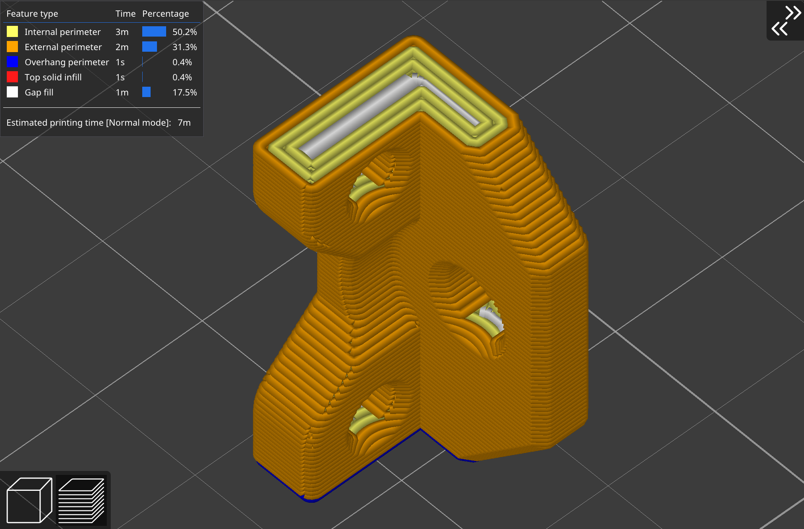 | 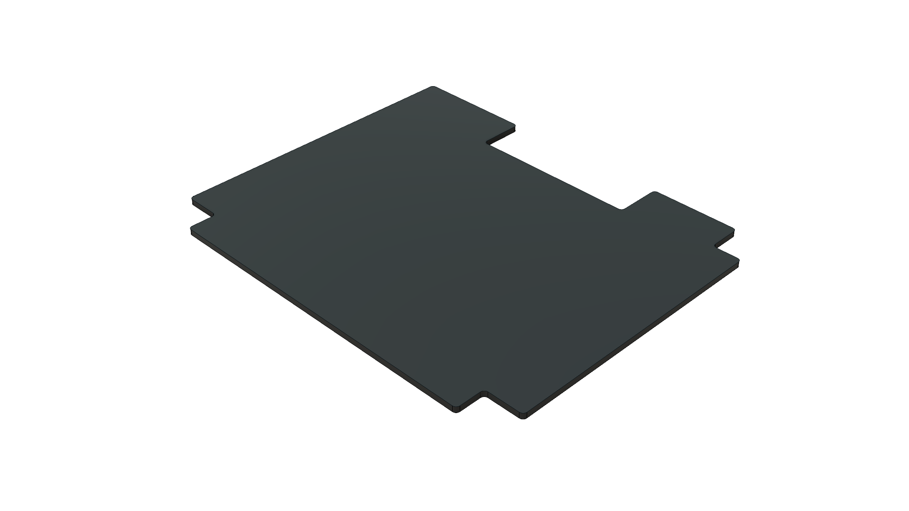 | 600+ lines added! |
| - | - | - | - |
| Screw-in Shaft Caps | Updated Z joint orientation | Baseplate with corners | New docs all over |

* **Screw-in Shaft Caps**: These match updated MotorCorners; they'll never break now, with no clips in shear.  Much nicer.

* **Updated Z joint orientation**: Now printed vertically, to add strength in bending.  Should reduce the chance of breaking a $0.01 Z joint print upon head crashes.

* **Baseplate file with cutouts added**: Long-requested; saves the need to bust out your flush cutters or Dremel, if you're sourcing from scratch.

* **Docs**: Lots has been learned in the last year of T0, and now we have specific motor recommendations, config notes, tips, build steps, and an FAQ.  More visual, more engaging.  No proper manual yet, but this gets us halfway there.

Thanks to everyone who contributed to this release by testing parts!  You know who you are, and you'll get the ping-for-test again, I assure you :smile:.

I'm behind on reviewing GitHub pull requests, and that's up next: to make your mods more visible.

## Prior Changes

Prior changes (alpha-5, alpha-4, ...) are now noted in the **[visual changelog](CHANGES.md)**, which explains how T0 has evolved and walks through the interesting parts.

### Build Options: an Overview

No two builds are likely to be identical, and that's OK.  You're a smart, independent builder, and here you get to choose amongst the options to match your priorities and budget.  Next up is a quick overview, with the shared elements after.

#### Least-cost Stock-size Option: "starving student special" conversion - $0-$75

**Performs well, at minimum cost.**

Buy 3 small NEMA14 motors (< ~$30), print some sliders, and keep using your MGN7H X rail.  Buy some pulleys ($5), belt ($5), and fasteners ($10ish).  Buy a low-cost 2-4 driver board ($25).  Potentially $0 if you have the parts lying around from other printer, including magents and a switch for ZeroClick.  Sure, the rear bed joint might occasionally drop when the power cuts, and the sliders require a little bit of tuning, but once the printer rehomes, you're good, and the Z motion quality should match real rails.

#### Premium Model, 120x120: ~$110

**Performs the best.**

Might as well upgrade your X rail to MGN9C while you're at it ($15?), to  reduce toolhead flop.  Use beefy 48mm NEMA17s (~$45), and for rails, add one MGN7H to go with the one you just freed up ($15).  Otherwise the same.

#### Least-cost Plus50 BoxZero conversion: ~170x170: ~$150 to ~$200

You're also looking at a new K3-style or Prusa-Mini-style bed/magnet/flexplate ($35+), additional extrusion pieces ($30), new 200mm XY MGN7Hs and a 200mm MGN9C ($50), plus new longer XY belts ($10).  Yields a bit of extra Z travel too.

The price point is maybe $50 less if you're scratch-building and can leave out the Z rails, or you sell all the rails from your kit to someone who is scratch-building.  More details in the Plus50 section.

#### Premium Model, ~170x170: ~$200-$300

Move 4x MGN7H rails to Z, for ~130mm Z travel.

Optionally, add new clear ($20) and solid panels ($20).

Optinally, add a top-grade bed, like one from Mandala Rose Works meant for a Salad Fork.

Optionally, go for taller panels, taller BoxZero corners, custom frame, and 200mm MGN7H Z rails, to get a 170x170x170 build cube.

### Additional Credits / History

This printer is inspired by lessons learned while designing, building, and iterating on [F-Zero](https://github.com/zruncho3d/f-zero), a Voron Zero mod to add automatic calibration to a V0. Initial versions of T0 (alpha-1 and alpha-2) used F0 Z units with pulley reductions.  Now, T0 has moved to direct drive for Z, and the two designs now have almost no shared parts.

The [Buildlog Gdoc](https://docs.google.com/document/d/1kADhQN-p30GZuGi_6izB4IUN-McIifvLVtg8yTzIAgo/edit#) has historical details and links to early versions there.

The tensioner part derives from [MCMBen's Block-and-Tackle Z for V0](https://github.com/Fleafa/VoronUsers/blob/master/printer_mods/MCMBen/Voron0_Block_and_Tackle_Z_Belt/STLs/%5Ba%5D_tensioner_v1.stl) - Zruncho prints this vertically for clean surfaces, but make sure you have good layer adhesion.

The 4.3" Waveshare Touchscreen mount is based on Jeoje's great Voron2.4 [Touchscreen mod](https://github.com/VoronDesign/VoronUsers/tree/master/printer_mods/jeoje/4.3_Inch_Touchscreen_Mount).

The Mini 12864 Display mount is based on Gola's [V0 Trident Skirt Mix](https://github.com/VoronDesign/VoronUsers/tree/master/printer_mods/golas/v0-trident-skirt-mix).
