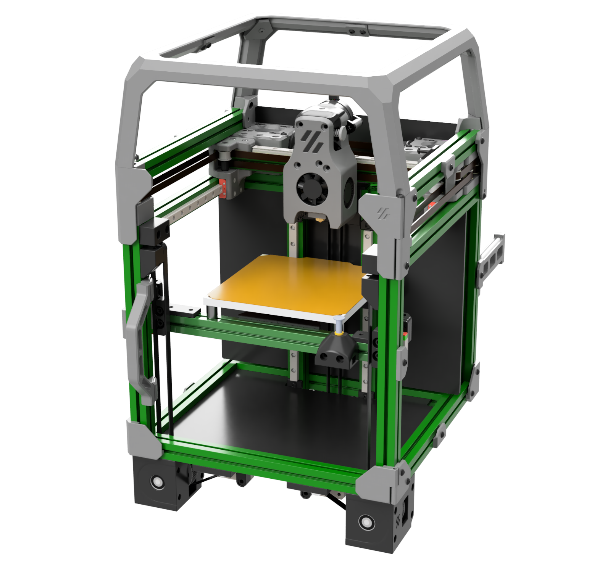

# Tri-Zero - a triple-belted-Z V0 mod
by Zruncho and DoomCube #tri-zero collaborators

### Make every first layer perfect!
### Upgrade your V0 or build a fresh T0.  
### Full auto-calibration.

## Alpha Release 2021-11-07

**The goal of the Tri-Zero project is to build a killer V0 with full auto-calibration.**

Ideally, it would:
- reuse as many V0 parts as possible
- stay within the bounding box of a V0
- retain the original printing envelope
- cost less than $100 to modify a V0, including all components
- be complete-able in one or two "Nero stream units" of a few hours
- be sourced with widely available components

That's a tall order, and we're not there yet.

Join us on the [DoomCube Discord](https://discord.gg/DASuYj9F) to help make this a reality.

### Status

2021-11-07 Status:
* T0-Alpha-Green can automatically level itself, as of today!  Images and video proof are coming soon.  Real life nearly matches the CAD.
* CAD and STLs now available.

### Buildlog and Design Doc

[See the Assembly Manual and Buildlog Gdoc](https://docs.google.com/document/d/1kADhQN-p30GZuGi_6izB4IUN-McIifvLVtg8yTzIAgo/edit#) for more details. While the printer is in development, this Gdoc is the source of truth.

Find a changelog, highlights, history, FAQ, and more there.

### What do you mean by Alpha Release?

It's a collection of early, rapidly-evolving parts, that you can look at, learn from, and maybe even improve upon.  

The parts actually work to enable functional triple-bed-leveling, so you can build a working printer with it.

To test the concept as quickly as possible, this release re-uses many parts from other sources, especially [F-Zero](https://github.com/zruncho3d/f-zero). But the 4x Z reduction really isn't needed for a bed that is 1/3 the weight of an F-Zero gantry.

Think of it as a functioning work-in-progress in advance of a future V0 beta or actual release.  The tentative goal with the beta is to keep the concept, but remove the need for drive units that require shafts, bearings, and pulleys, and which prevent keeping the electronics in the space on the bottom.

### What is missing in the Alpha Release?

What's missing is a final bed probing solution.

There are a number of options out there for bed probing, all under test.  See #tri-zero on the DoomCube discord for the latest.

### What's in this repo?

In this repo are some of the STLs needed to build a Tri-Zero Alpha.

All parts should be already be in print-ready orientation, and no supports are needed.

Standard Voron settings, or lowered infill and fewer perims, should work fine for most parts:
- 4 perimeters
- 40% infill, depending on the part
- 0.2mm layer height

### What do I need to build a Tri-Zero Alpha?

For printed parts, you need the STLs in the quantites noted from this repo, along with STLs from a bunch of places:
- [F-Zero](https://github.com/zruncho3d/f-zero): Z drive units (drive outer, drive inner, motor mounts), no-drop nuts, KGLM-03 joint parts
- [Tensioner from MCMBen's Block-and-Tackle Z for V0](https://github.com/Fleafa/VoronUsers/blob/master/printer_mods/MCMBen/Voron0_Block_and_Tackle_Z_Belt/STLs/%5Ba%5D_tensioner_v1.stl) - Zruncho printed this vertically for clean surfaces, but make sure you have good layer adhesion.
- L.e.o.p.a.rd's endstop assembly - see [F-Zero gdoc for instructions](https://docs.google.com/document/d/1dm8itefYrLIsCcOQht9sdMzrXE8Jk30s56c9IwtRCkM/edit)
- More M2 nutbars from V0

For non-printed parts, look in the [F-Zero](https://github.com/zruncho3d/f-zero) repo's BOM.  The non-printed stuff is currently a strict subset of F-Zero parts.

In addition, an MGN9 or dual-MGN7 X gantry is highly recommended!  You don't want toolhead flop to affect bed-probe results or print quality.  Hartk1213 has an [MGN9 mod for V0](https://github.com/Fleafa/VoronUsers/tree/master/printer_mods/hartk1213/Voron0_MGN9C_X_Axis) which is in use in the first prototype.

### What if I have questions?

Look at the render and CAD first.

Then, go the DoomCube Discord and ask on the #tri-zero channel, because the render and CAD are early and incomplete :-)