# Tri-Zero - a triple-belted-Z V0 mod
a Voron Zero mod to add Automatic Bed Leveling - under $100, in only a few hours.

**T0** provides the quality-of-life benefits of flying-gantry mods like [F-Zero](https://github.com/zruncho3d/f-zero), but in a fraction of the build time, at much lower cost.

*You don't even need to take the frame apart to do a V0 conversion.*

Main features:
* Perfect Z layers, quiet motion, and great bed stability from a triple belted Z axes
* Integrated Klicky-style bed probing with [ZeroClick](https://github.com/zruncho3d/ZeroClick)
* Rear endstop enables [automatic Z calibration](https://github.com/protoloft/klipper_z_calibration) and more
* Snap-in, quick-print side panels with [ZeroPanels](https://github.com/zruncho3d/ZeroPanels)
* Easy bed attachment and removal: 3 screws each
* Easy belt attachment and removal: fully tool-less
* Easy single-screw tensioning on all axes
* Easy to assemble: no hard-to-access screws or assembly-order requirements
* Your choice of display: 4.3" Touchscreen, 12864, V0 Mini Display, or blank panel.  
* Supports NEMA14 and NEMA17 Z motors: use whatever you've got lying around!

*This repo includes everything you need to build your own T0, including CAD and STLs for printed parts, as well as a list of parts.*

And if you wanna get really crazy... this mod combines well with [Double Dragon](https://github.com/zruncho3d/double-dragon), an IDEX V0 mod.

**Make every first layer perfect!** Upgrade your V0 or build a fresh T0.  

Join us on the `#tri-zero` on the [DoomCube Discord](https://discord.gg/doomcube) for any questions, comments, or just to see the latest dev activity.

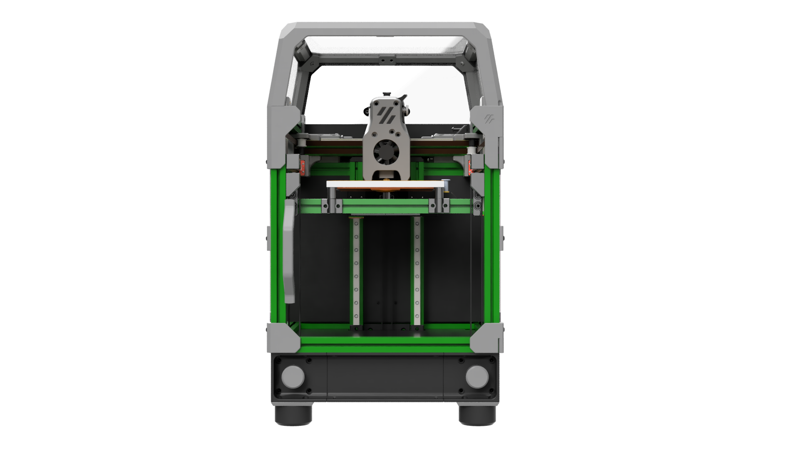

| 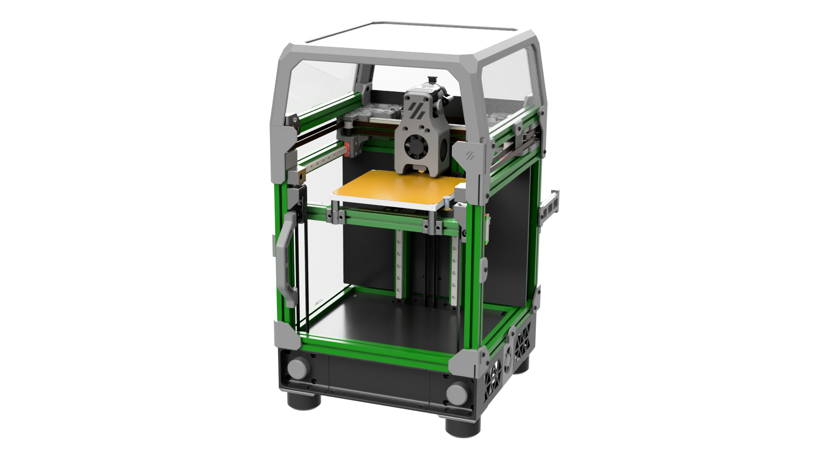 | 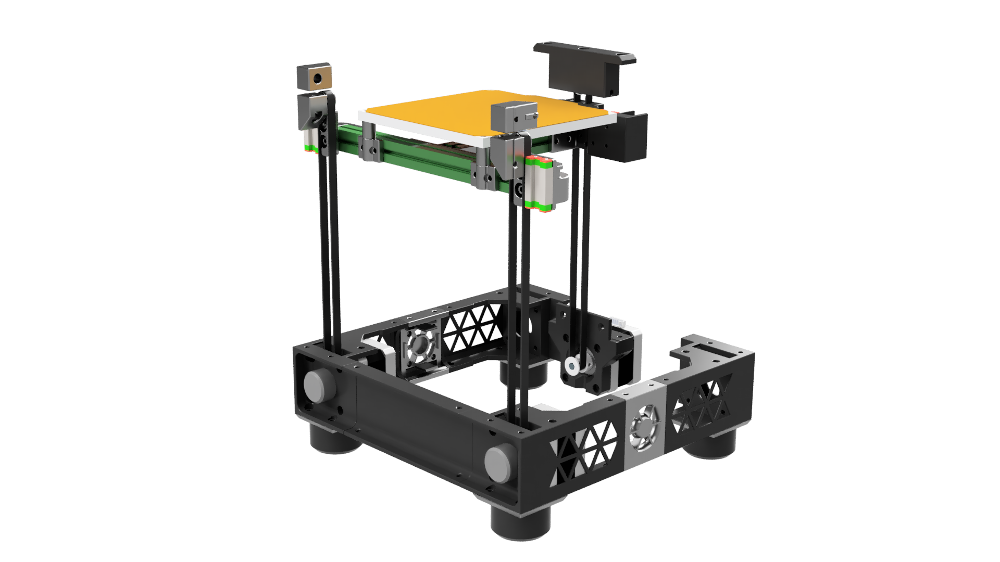  |
| - | - |

| 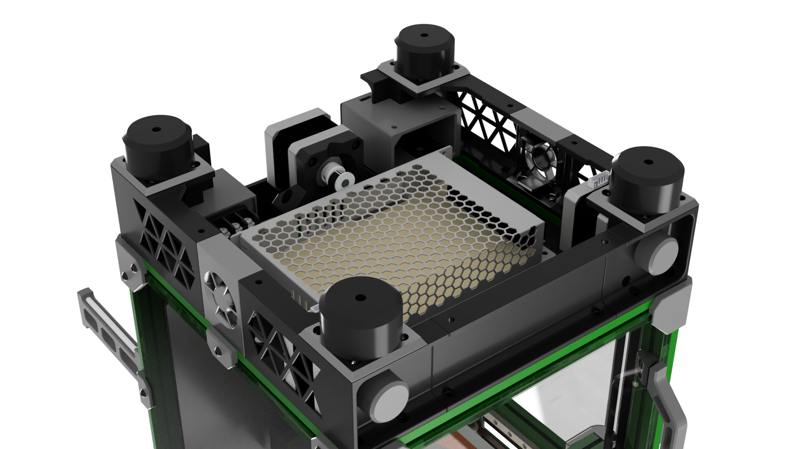 | 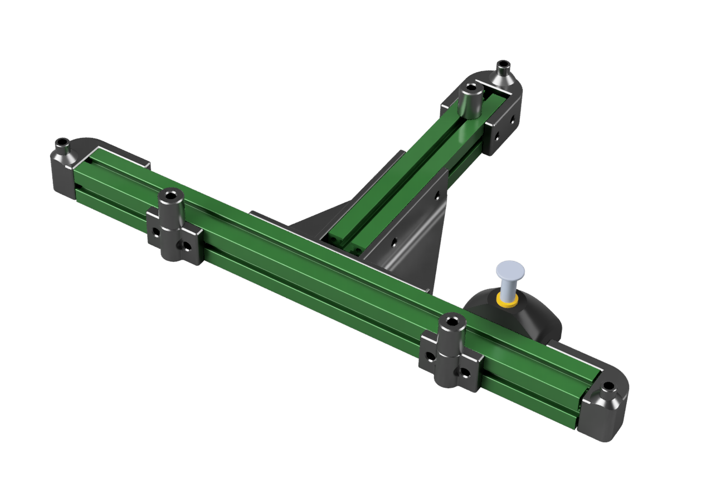 | 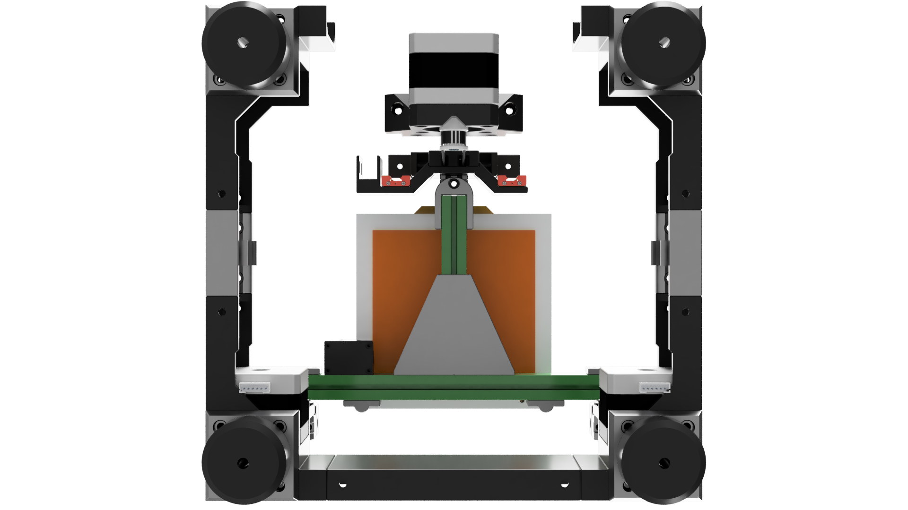 |
| - | - | - |

(NOTE: renders are for alpha-4)

## Latest Release: Alpha-5

Ready to print!  What are you waiting for?  Multiple T0s are printing or on their way to printing soon.

### Updates

#### 2022-02-16 Update: $#!+ Just Got Real

**(1)** We have our first Voron-serial'ed Tri-Zero!  Congrats to Red5, whose black-and-blue Tri-Zero looks great and prints great:

  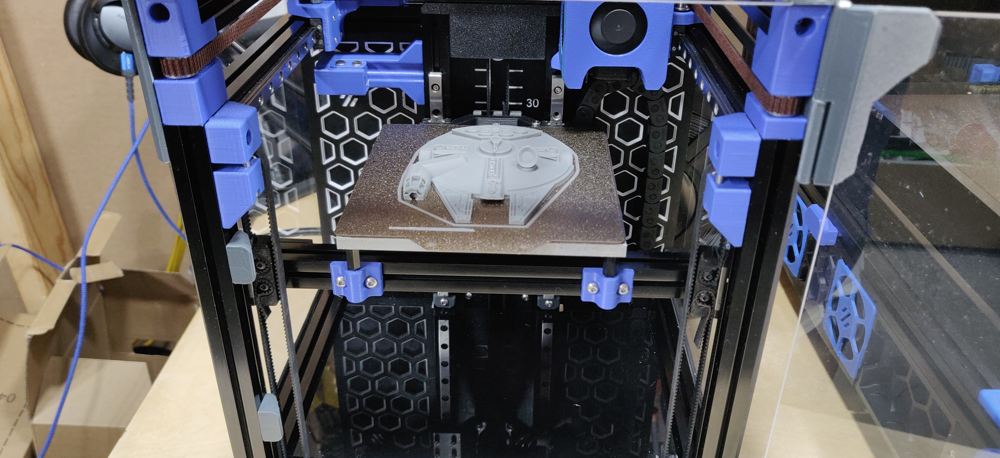

Definitely check out the [serial request video for V0.1382](https://www.reddit.com/r/voroncorexy/comments/simwer/trizero_t0_serial_request_v01_red5_8573/) to see what this T0 looks like, printing.  Red5 reports:

> So far no issues at all with the layers...  I also have printed a few 120mm tall items with perfect vertical layers.

Yes, direct-drive 1.8-degree stepper motors work great in this application!  We can get away with no reduction when the bed assembly is only ~500g, unlike printers with ~1800g flying gantries.  Direct drive is simpler, more reliable, and lower-cost.

**(2)** We have our first merged Pull Requests!  Props to csch, who contributed 3 different parts in the new Mods folder.

**(3)** We have our first complete release, in Alpha-5!  This includes many new or improved parts:

**New:**
* [ZeroClick](https://github.com/zruncho3d/ZeroClick) is out now, and is the default bed-probing solution for T0.  You don't need to reprint your MiniAB shroud.

  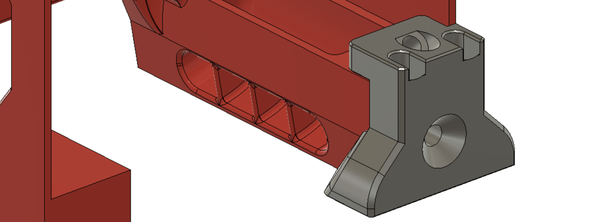

* [ZeroPanels](https://github.com/zruncho3d/ZeroPanels) are spun out now, and are the default enclosure solution for T0.  Prints in < 2 hrs and pops on and off.
  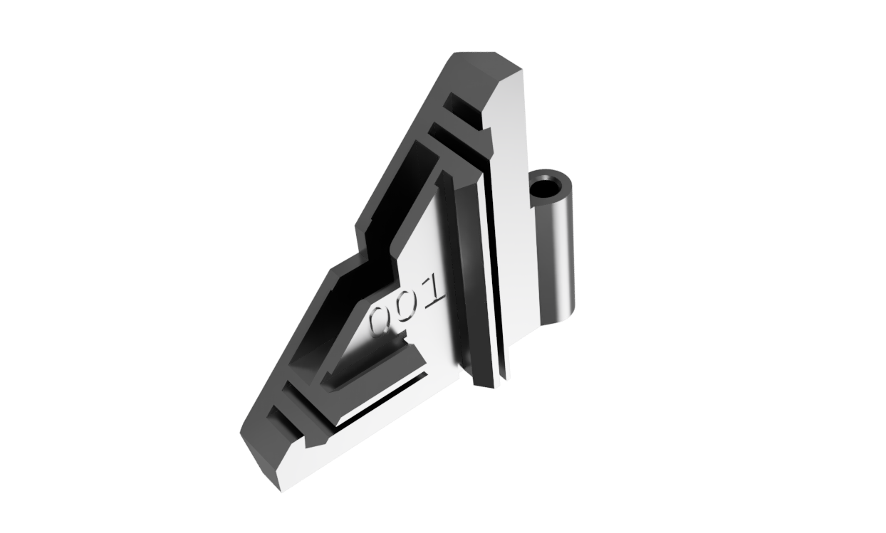
* New rear corners are in:

  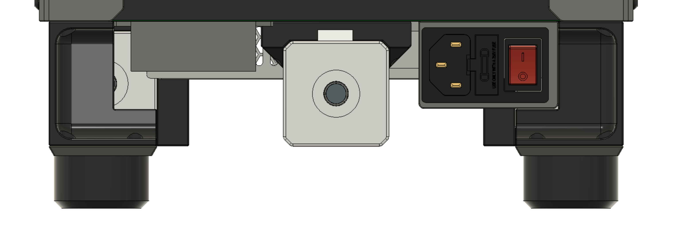
  Smaller, stronger (since they mount to the frame crossmember), and now you can reuse your V0.1 inlet.

* [4.3" Waveshare Touchscreen](https://www.amazon.com/dp/B088JTD6JN) mount added: a great way to add [KlipperScreen](https://github.com/jordanruthe/KlipperScreen), which keeps getting better.  Based on Jeoje's great Voron2.4 [Touchscreen mod](https://github.com/VoronDesign/VoronUsers/tree/master/printer_mods/jeoje/4.3_Inch_Touchscreen_Mount), but adapted to fit securely in a 1515 extrusion.

  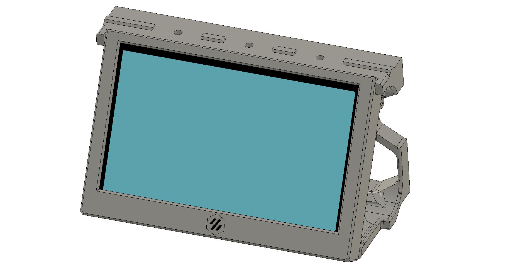

* [Mini 12864 Display](https://deepfriedhero.in/products/mini-12864-display) mount added: a super-affordable way to get a display you can easily read from a distance.  Based on Gola's [V0 Trident Skirt Mix](https://github.com/VoronDesign/VoronUsers/tree/master/printer_mods/golas/v0-trident-skirt-mix), but sized to fit T0.  You don't need the printed corners or guitar feet on your T0 with this one; instead, you can carry over the bumpers from a V0.1.

| 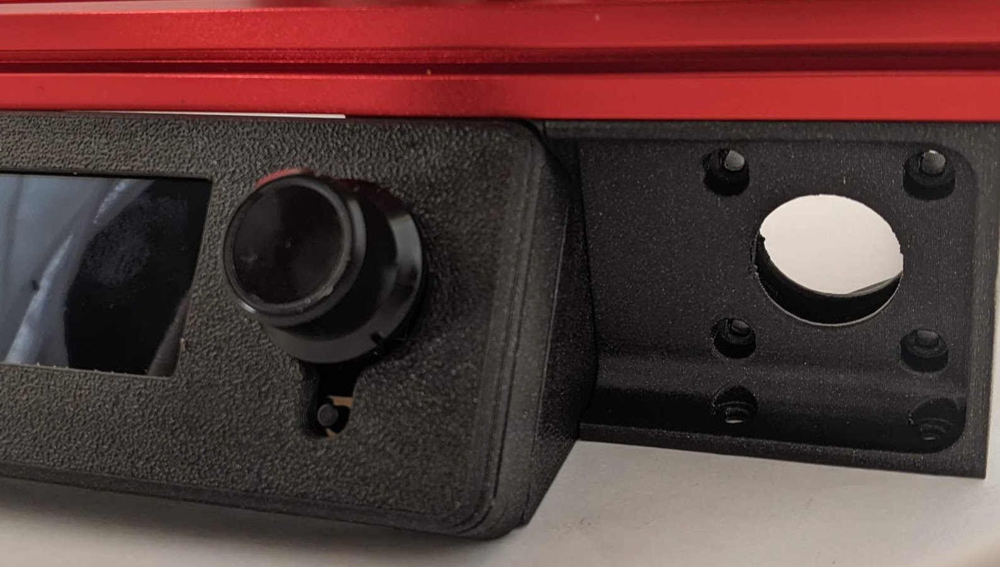 | 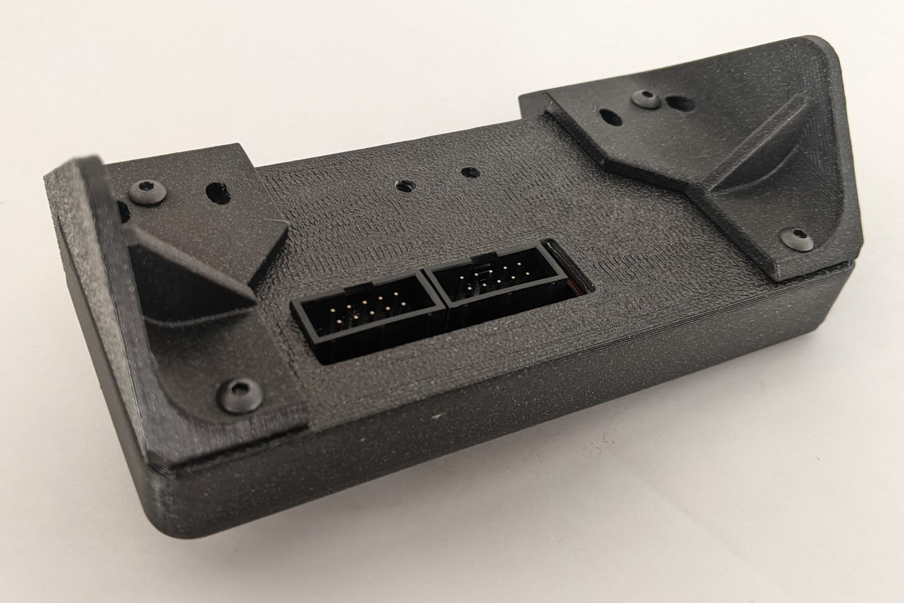 |  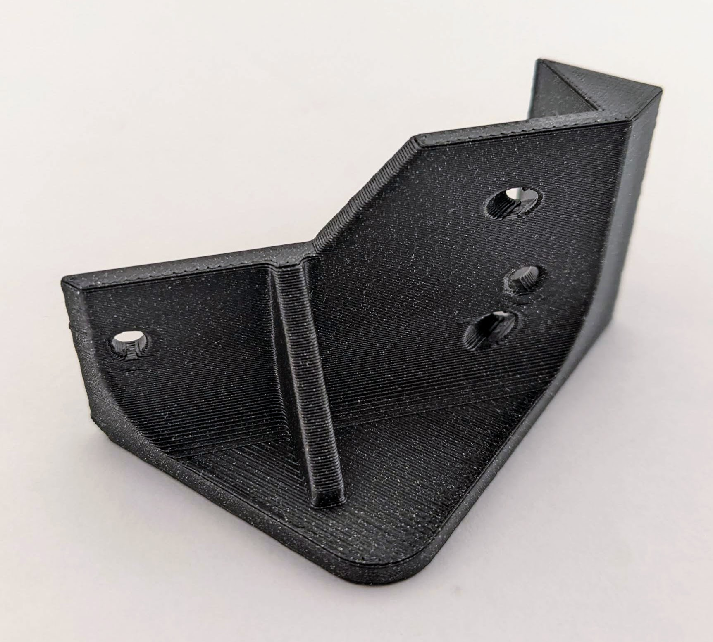
| - | - | - |

**Improved:**
* The Z Nozzle Endstop is now rear-mounted;

  Modified Rear Bed Mount and Front Bed Mounts have been added to match it.  You'll lose a few mm of rear Y travel, but the positioning works much better with [Double Dragon](https://github.com/zruncho3d/double-dragon), where it enables automatic toolhead offset calibration and wider beds.
* The Rear Z Mount is now taller:

  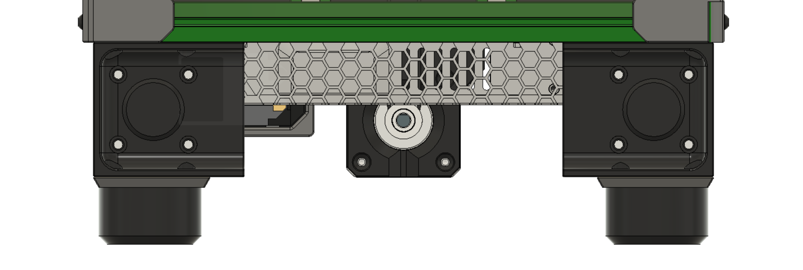
  This provides 3 real benefits:
  * Motors (whether NEMA14 or NEMA17) with long shafts no longer conflict with the power supply.
  * Z motors can be removed now, even with the mount in place, as there's more clearance from the power supply for the allen wrench to get in there.
  * Your T0-in-progress can sit flat with only 3 below-deck parts: 2x MotorCorners and one Rear Z Mount.
* Front MotorSkirts now have larger cutouts to fit motors with JST pins... like mine.

What's coming next?  More community contributions, more size options, and more QoL upgrades.  Maybe even a beta release... it's starting to stabilize.  (Famous last words, you say).

As usual, all parts have been pre-oriented for easier printing, and the CAD has been updated.  Enjoy!

#### 2022-02-08 Update
* [ZeroClick](https://github.com/zruncho3d/ZeroClick) is out!  Fast & simple bed probing for tiny printers... like Klicky, but sized right.  The default now for Tri-Zero.  Actually, ZeroClick is a T0 spinoff proect, just like ZeroPanels, but since both have much broader relevance to more V0-ish printers, they live in other GitHub repositories.

#### 2022-01-23 Update
* [ZeroPanels](https://github.com/zruncho3d/ZeroPanels) are out!  These provide an option for easily enclosing your T0, while providing the additional gap needed to enable the carriages to stick out of the frame.  They pop on and off in seconds and reuse your clear panels and front printed parts from a V0.

#### 2022-01-20 Update
* T0-Alpha-4 released, with 11 new parts.
* **Now supports NEMA14 and NEMA17**: use what you've got!
  * The new MotorSkirts push the motors as far out as possible, freeing up enough space to fit larger power supplies  more easily (between motors or against the motor rear plates).  
  * The front skirt can be swapped for a [4" touchscreen mod](https://github.com/Fleafa/VoronUsers/tree/V0.1-Trident-skirt/printer_mods/roboticator24/4inch_touchscreen_mount_for_v2.4) for [KlipperScreen](https://github.com/jordanruthe/KlipperScreen).  
  * Guitar Feet (4x) can be added to give a nice handle with the skirts... or, retain the original V0 bumpers.
* New rear motor mount: now, mounts to the nuts you'd already have on a V0 if doing a conversion.  This is a huge deal!  To convert a V0, you no longer need to dissassemble the rear frame.
* New clip-in 30mm fan mounts on the sides for side-to-side airflow.
* New clip-in front motor pulley covers.  Leave them out if you want to see Z motion or put some spinners on.
* Slightly thinner rear Z idlers: now they fit within the extrusion thickness of 15mm.  Two benefits: more space for a probe back there (hint, hint) and now the center tensioner fits a regular 12mm BHCS, so no cut screw or washers are needed anymore.
* CAD and STLs for alpha-4 are now available.  The original V0.1 bed assembly is gone, for a smaller file size, but Fusion is failing to export, so .step only for this one.
* Want to contribute?  PRs would be welcome for these improvements:
  * Integrated probing solution
  * Rear side skirts with less material.  Duplicating the front skirts adds unnecesary material and gets in the way of a rear outlet.  I got tired and chose to release this instead of modding the skirt.  Other improvements matter more.
  * Integrated bed Wago mount (5x2)

#### 2022-01-16 Update:
Initial BOM posted below.  No large changes are expected, but no promises are made w/an alpha!

#### 2022-01-11 Update:
* T0-Alpha-3 released: **now with less!**
* **Now Direct-Drive** - yes, this is a huge change.  Frees up space, lower costs, and speeds up the conversion time.  And yes, regular NEMA14 motors seem to have just enough unpowered hold and enough resolution to make this work in practice.  Long (V0.1-spec) NEMA14s should be overqualified to hold the bed when the power cuts out.
* **Now using MCMBen Trident-style skirts** - these look great and enable integrated side skirts with motor mounts.  Only needs one part and its mirror to change, the front corners, to add clearance for the front belt pulleys.  See the repo for these.
* Simplified Z attachments: easier and faster to print, increases Z travel (122mm out of the box), and also removes 6 M2 screws.
* New rear motor attachment piece.  It's basically a block.
* Updated front idlers: reduces the material needed and slightly increases clearance for another mm of X travel.
* CAD and STLs for alpha-3 are now available.  GitHub limits files to 100 MB and the Fusion export is just a bit too large.  [Go here for the Fusion export](https://drive.google.com/file/d/1fiEJLRE4qYLFB2CRu8r5_06jv_Fr14W6/view?usp=sharing).
* What's coming next?
   * Redone integrated skirts.  The motors are too far inboard now, which wastes space and loads the motor bearings unnecessarily.  This was intentional, to minimize skirt changes, but if we go full-custom with the skirts, they can be more optimized for Tri-Zero.  For example, by extending beyond the frame boundary - to the enclosure boundary - it should be easier to enable NEMA17 motors.
   * A probing solution is coming, called ZeroClick, but it needs a corresponding dock created before release.
   * A rear Z motor mount that doesn't change the nut locations relative to V0.1 would be nice!
   * Lessons from Double Dragon point the way to probably 130mm Z (!) using the same rails.
   * ZeroPanels are coming soon: screwless, nutless, magnetless, toolless enclosure panels that attach and remove in seconds.
   * Maybe... just maybe... a block-and-tackle Z for 2x resolution and torque.
   * Some built-in solution for mounting Wagos under the bed.

#### 2021-11-15 Update:
* T0-Alpha-2-Green can **reliably** and automatically level itself.  Config coming soon.
* The new flexure joints beat the KGLM03 joints in smoothness, as they converge *very* quicky when doing automatic leveling, plus drop a few bucks from the cost total.
* Z has been increased to right about 120mm, and nearly all main Z motion parts had to change to enable this.
* Front idlers were narrowed a bit to avoid a tiny bit of interference in the very front of the printer.  
* CAD and STLs for alpha-2 are now available.   
* What's coming next?
  * Lessons from alpha-2 will lead to a much simpler alpha-3, likely with even taller Z (beyond 120mm).
  * Different detachable probe options are under testing, including SideSwipe and a stretched Klicky-style probe.

#### 2021-11-07 Update:
* T0-Alpha-1-Green can automatically level itself, as of today!  Images and video proof are availabe on Discord.  Real life nearly matches the CAD.
* CAD and STLs for alpha-1 now available.

### BOM preview

This BOM preview is for Alpha-4, though there's no expectation that these parts will change.  The BOM will become more specific over time, as more of the design gets tested and finalized.

| Category | Part | Qty | Notes |
| - | - | - | - |
| Fasteners | M2x6 BHCS or SHCS | 10+ | For retaining the Z attachments in rear (2), 6-8 for the rear Z bar, plus one per front idler (2) |
| Fasteners | M2x8 BHCS or SHCS | 4+ | For retaining the Z belt attachments in front |
| Fasteners | M2 nuts | 12 | For M2 nutbars
| Fasteners | M3 BHCS (various) | Yes | For Z idlers (vertical), Z idler attachments (horizontal), motor mounts, skirts, +lots more
| Fasteners | M3 nuts | Yes |
| Fasteners | M3 heatset inserts | Yes | For motors, bed mounts (2 + 3), motor skirts (4x3), z belt attachment (4) and more
| Z Drives | GT2 belt | 3x~450mm |
| Z Drives | GT2 16t pulleys | 3 |
| Z Drives | MGN7H 150mm | 2 | Ideally upgrade to MGN9C on the X carriage and then get only one of these to repurpose for a front Z drive.  See the nte below.
| Z Drives | NEMA14 or NEMA17 motors | 3 | Needs to have enough hold torque.  Mid-size (33mm body length) NEMA14 are marginal, while long (48mm body length) NEMA14 or most mid-to-large NEMA17 will provide enough unpowered hold torque to keep the bed from dropping.  Ideally 0.9mm for extra resolution.  Mix and match should be fine.  Use what you've got.  The Z drive motors barely matter.
| Z Drives | F623 bearings | 6 | Idlers |
| Bed | Sexbolt endstop kit | 1 + 1 | Needed for Auto-Z, though technically optional, if you use a virtual endstop in Klipper |
| Frame | Guitar Feet | 4 | Optional; same as used with Voron Trident.  Can use original V0.1 rubber feet instead.

In addition, you'll need parts for ZeroClick, plus some way to get extra drivers.

### What do you mean by Alpha Release?

It's a collection of early, rapidly-evolving parts, that you can look at, learn from, and maybe even improve upon.  

The parts actually work to enable functional triple-bed-leveling, so you can build a working printer with it.

To test the concept as quickly as possible, early alpha releases re-used many parts from other sources, especially [F-Zero](https://github.com/zruncho3d/f-zero). But the 4x Z reduction really wasn't needed for a bed that is 1/3 the weight of an F-Zero gantry, so at alpha-3, everything moved to direct drive.

Think of it as a functioning work-in-progress in advance of a future T0 beta or actual release.

### What is missing in the Alpha Release?

As of Alpha-5 nothing.

### What's in this repo?

In this repo are all of the STLs needed to build a Tri-Zero Alpha which are not in the V0.1 repo.

All parts should be already be in print-ready orientation, with seam in the +Y dir, and no supports are needed.

Standard Voron settings, or lowered infill and fewer perims, should work fine for most parts:
- 4 perimeters
- 40% infill, depending on the part
- 0.2mm layer height

The MotorSkirts and Rear Corners are happy with 20% infill, for a bit of print speedup.

### Printed Parts

For printed parts, you need the STLs in the quantites noted from this repo, along with STLs from a bunch of places:
- [ZeroPanels](https://github.com/zruncho3d/ZeroPanels)
- [Zeroclick](Renders/alpha-5/zeropanel_clip.png) (if enclosing)
- From [F-Zero](https://github.com/zruncho3d/f-zero):
  - [No-drop nuts](https://github.com/zruncho3d/f-zero/tree/main/STLs/NoDropNuts)
  - [12mm Bed Spacers](https://github.com/zruncho3d/f-zero/blob/main/STLs/Bed/bed_spacer_12mm_x3.stl)
- More M2 nutbars from V0

### Non-printed Parts

An MGN9C or dual-MGN7X gantry is highly recommended!  You don't want toolhead flop to affect bed-probe results or print quality.  Hartk1213 has an [MGN9 mod for V0](https://github.com/Fleafa/VoronUsers/tree/master/printer_mods/hartk1213/Voron0_MGN9C_X_Axis) which is in use in the first prototype.

### What if I have questions?

The renders and CAD should answer many questions first.

Then, go the DoomCube Discord and ask on the #tri-zero channel.

### Additional Credits / History

This printer is inspired by lessons learned while designing, building, and iterating on [F-Zero](https://github.com/zruncho3d/f-zero), a Voron Zero mod to add automatic calibration to a V0. Initial versions of T0 (alpha-1 and alpha-2) used F0 Z units with pulley reductions.  Now, T0 has moved to direct drive for Z, and the two designs now have almost no shared parts.

The [Buildlog Gdoc](https://docs.google.com/document/d/1kADhQN-p30GZuGi_6izB4IUN-McIifvLVtg8yTzIAgo/edit#) has historical details and links to early versions there.

The tensioner part derives from [MCMBen's Block-and-Tackle Z for V0](https://github.com/Fleafa/VoronUsers/blob/master/printer_mods/MCMBen/Voron0_Block_and_Tackle_Z_Belt/STLs/%5Ba%5D_tensioner_v1.stl) - Zruncho prints this vertically for clean surfaces, but make sure you have good layer adhesion.

The 4.3" Waveshare Touchscreen mount is based on Jeoje's great Voron2.4 [Touchscreen mod](https://github.com/VoronDesign/VoronUsers/tree/master/printer_mods/jeoje/4.3_Inch_Touchscreen_Mount).

The Mini 12864 Display mount is based on Gola's [V0 Trident Skirt Mix](https://github.com/VoronDesign/VoronUsers/tree/master/printer_mods/golas/v0-trident-skirt-mix).