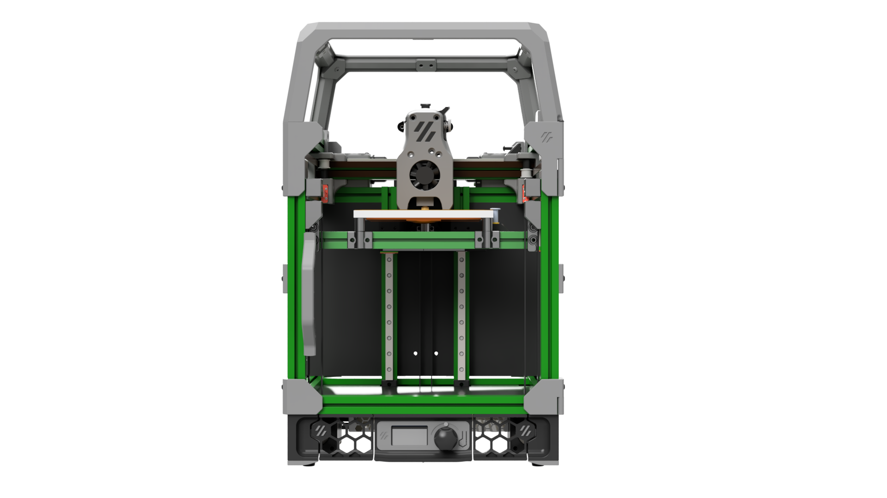
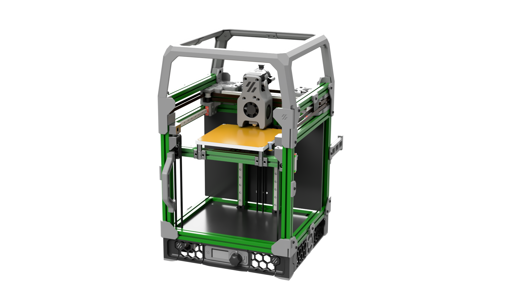
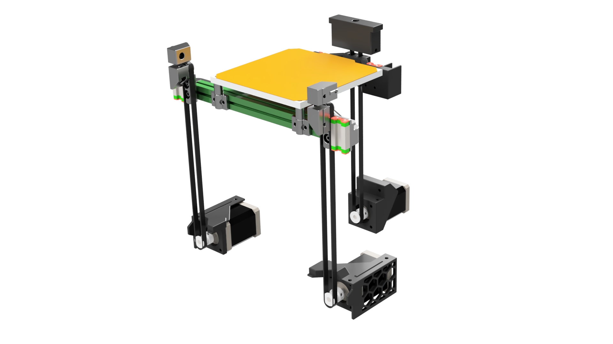

# Tri-Zero - a triple-belted-Z V0 mod
by Zruncho and DoomCube #tri-zero collaborators

### Make every first layer perfect!
### Upgrade your V0 or build a fresh T0.  

## Alpha-3 Release 2022-01-11

**The goal of the Tri-Zero project is to build a killer V0 with full auto-calibration.**

Ideally, it would:
- reuse as many V0 parts as possible
- stay within the bounding box of a V0
- retain the original printing envelope
- cost less than $100 to modify a V0, including all components
- be complete-able in one or two "Nero stream units" of a few hours
- be sourced with widely available components

That's a tall order, but with the shift to direct drive with alpha-3, we're basically there.

Join us on the [DoomCube Discord](https://discord.gg/doomcube) to help make this a reality.

### Updates

2022-01-16 Initial BOM posted below.  No large changes are expected, but no promises are made w/an alpha!

2022-01-11 Update:
* T0-Alpha-3 released: **now with less!**
* **Now Direct-Drive** - yes, this is a huge change.  Frees up space, lower costs, and speeds up the conversion time.  And yes, regular NEMA14 motors seem to have just enough unpowered hold and enough resolution to make this work in practice.  Long (V0.1-spec) NEMA14s should be overqualified to hold the bed when the power cuts out.
* **Now using MCMBen Trident-style skirts** - these look great and enable integrated side skirts with motor mounts.  Only needs one part and its mirror to change, the front corners, to add clearance for the front belt pulleys.  See the repo for these.
* Simplified Z attachments: easier and faster to print, increases Z travel (122mm out of the box), and also removes 6 M2 screws.
* New rear motor attachment piece.  It's basically a block.
* Updated front idlers: reduces the material needed and slightly increases clearance for another mm of X travel.
* CAD and STLs for alpha-3 are now available.  GitHub limits files to 100 MB and the Fusion export is just a bit too large.  [Go here for the Fusion export](https://drive.google.com/file/d/1fiEJLRE4qYLFB2CRu8r5_06jv_Fr14W6/view?usp=sharing).
* What's coming next?
   * Redone integrated skirts.  The motors are too far inboard now, which wastes space and loads the motor bearings unnecessarily.  This was intentional, to minimize skirt changes, but if we go full-custom with the skirts, they can be more optimized for Tri-Zero.  For example, by extending beyond the frame boundary - to the enclosure boundary - it should be easier to enable NEMA17 motors.
   * A probing solution is coming, called ZeroClick, but it needs a corresponding dock created before release.
   * A rear Z motor mount that doesn't change the nut locations relative to V0.1 would be nice!
   * Lessons from Double Dragon point the way to probably 130mm Z (!) using the same rails.
   * ZeroPanels are coming soon: screwless, nutless, magnetless, toolless enclosure panels that attach and remove in seconds.
   * Maybe... just maybe... a block-and-tackle Z for 2x resolution and torque.
   * Some built-in solution for mounting Wagos under the bed.

2021-11-15 Update:
* T0-Alpha-2-Green can **reliably** and automatically level itself.  Config coming soon.
* The new flexure joints beat the KGLM03 joints in smoothness, as they converge *very* quicky when doing automatic leveling, plus drop a few bucks from the cost total.
* Z has been increased to right about 120mm, and nearly all main Z motion parts had to change to enable this.
* Front idlers were narrowed a bit to avoid a tiny bit of interference in the very front of the printer.  
* CAD and STLs for alpha-2 are now available.   
* What's coming next?
  * Lessons from alpha-2 will lead to a much simpler alpha-3, likely with even taller Z (beyond 120mm).
  * Different detachable probe options are under testing, including SideSwipe and a stretched Klicky-style probe.

2021-11-07 Update:
* T0-Alpha-1-Green can automatically level itself, as of today!  Images and video proof are availabe on Discord.  Real life nearly matches the CAD.
* CAD and STLs for alpha-1 now available.

### BOM preview

This BOM preview is for Alpha-3, though there's no expectation that these parts will change.  The BOM will become more specific over time, as more of the design gets tested and finalized.

| Category | Part | Qty | Notes |
| - | - | - | - |
| Fasteners | M2x6 BHCS or SHCS | 10+ | For retaining the Z attachments in rear (2), 6-8 for the rear Z bar, plus one per front idler (2) |
| Fasteners | M2x8 BHCS or SHCS | 4+ | For retaining the Z belt attachments in front |
| Fasteners | M2 nuts | 12 | For M2 nutbars
| Fasteners | M3 BHCS (various) | Yes | For Z idlers (vertical), Z bearing holder (horizontal), + lots more
| Fasteners | M3 nuts | Yes |
| Fasteners | M3 heatset inserts | Yes | For motors, bed mounts, frame corners and more
| Z Drives | GT2 belt | 3x~450mm |
| Z Drives | GT2 16t pulleys | 3 |
| Z Drives | MGN7H 150mm | 2 | Ideally upgrade to MGN9C on the X carriage and then get only one of these.
| Z Drives | NEMA14 (for alpha3 or alpha4) or NEMA17 motors (for alpha4, when released) | 3 | Needs to have enough hold torque.  Mid-size (33mm body length) NEMA14 are marginal, while long (48mm body length) NEMA14 or most mid-to-large NEMA17 will provide enough unpowered hold torque to keep the bed from dropping.  Ideally 0.9mm for extra resolution.  Mix and match should be fine.  Use what you've got.  The Z drive motors barely matter.
| Z Drives | F623 bearings | 6 | Idlers |
| Bed | Sexbolt endstop kit | 1 + 1 | Needed for Auto-Z, though technically optional, if you use a virtual endstop in Klipper |

In addition, you'll need parts for a bed probing solution, plus some way to get extra drivers.

### Buildlog and Design Doc

[See the Assembly Manual and Buildlog Gdoc](https://docs.google.com/document/d/1kADhQN-p30GZuGi_6izB4IUN-McIifvLVtg8yTzIAgo/edit#) for more details. While the printer is in development, this Gdoc is the source of truth.

Find a changelog, highlights, history, FAQ, and more there.

### What do you mean by Alpha Release?

It's a collection of early, rapidly-evolving parts, that you can look at, learn from, and maybe even improve upon.  

The parts actually work to enable functional triple-bed-leveling, so you can build a working printer with it.

To test the concept as quickly as possible, this release re-uses many parts from other sources, especially [F-Zero](https://github.com/zruncho3d/f-zero). But the 4x Z reduction really isn't needed for a bed that is 1/3 the weight of an F-Zero gantry.

Think of it as a functioning work-in-progress in advance of a future T0 beta or actual release.

### What is missing in the Alpha Release?

What's missing is a final bed probing solution.

There are a number of options out there for bed probing, all under test.  See #tri-zero on the DoomCube discord for the latest.

### What's in this repo?

In this repo are some of the STLs needed to build a Tri-Zero Alpha.

All parts should be already be in print-ready orientation, and no supports are needed.

Standard Voron settings, or lowered infill and fewer perims, should work fine for most parts:
- 4 perimeters
- 40% infill, depending on the part
- 0.2mm layer height

### Printed Parts

For printed parts, you need the STLs in the quantites noted from this repo, along with STLs from a bunch of places:
- [F-Zero](https://github.com/zruncho3d/f-zero): no-drop nuts
- L.e.o.p.a.rd's endstop assembly - see [F-Zero gdoc for instructions](https://docs.google.com/document/d/1dm8itefYrLIsCcOQht9sdMzrXE8Jk30s56c9IwtRCkM/edit)
- [MCMBen Trident-style V0 skirts](https://github.com/Fleafa/VoronUsers/tree/V0.1-Trident-skirt/printer_mods/MCMBen/Voron0_Trident_Skirt/STLs)
- More M2 nutbars from V0

In addition, an MGN9 or dual-MGN7 X gantry is highly recommended!  You don't want toolhead flop to affect bed-probe results or print quality.  Hartk1213 has an [MGN9 mod for V0](https://github.com/Fleafa/VoronUsers/tree/master/printer_mods/hartk1213/Voron0_MGN9C_X_Axis) which is in use in the first prototype.

### What if I have questions?

Look at the render and CAD first.

Then, go the DoomCube Discord and ask on the #tri-zero channel, because the render and CAD are early and incomplete :-)

### Additional Credits

The tensioner part derives from [MCMBen's Block-and-Tackle Z for V0](https://github.com/Fleafa/VoronUsers/blob/master/printer_mods/MCMBen/Voron0_Block_and_Tackle_Z_Belt/STLs/%5Ba%5D_tensioner_v1.stl) - Zruncho prints this vertically for clean surfaces, but make sure you have good layer adhesion.
